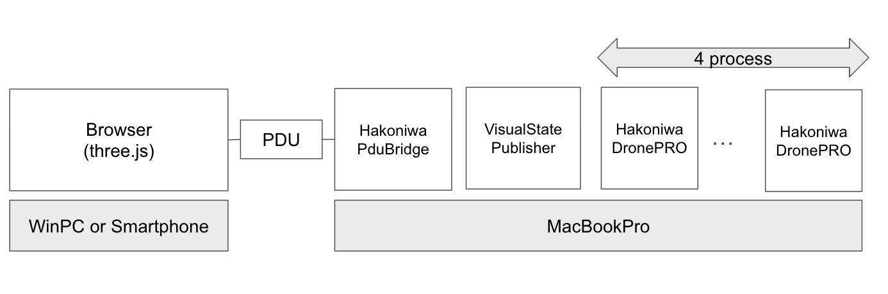

[日本語版](README.md)

This repository provides the core functionality of a drone simulator, evolved from [hakoniwa-px4sim](https://github.com/toppers/hakoniwa-px4sim) with enhanced extensibility and versatility. It features a flexible design that enables integration with PX4, Ardupilot, robotic systems (ROS), and even smartphones, XR, and the Web.

# 🚨 License Notice
This project is distributed under a custom non-commercial license.

- 📄 License (English): [LICENSE](LICENSE.md)
- 📄 ライセンス (日本語): [LICENSE-ja](LICENSE-ja.md)

⚠️ Commercial use is prohibited

For commercial licensing inquiries: tmori@hakoniwa-lab.net

👉 For the PRO version license (commercial use), see:
🔗 [Drone PRO License (Japanese)](https://github.com/hakoniwalab/hakoniwa-license/blob/main/licenses/drone-pro-license)

# Concept

With the motto "Break out of the simulation world!", we are based on the following three pillars:

- **Simplicity**: A drone simulator that anyone can easily use.
- **Diversity**: Supports a wide range of applications such as games, education, research, and business.
- **Connectivity**: Seamless integration with PX4/Ardupilot, Unity, Unreal Engine, ROS, smartphones, XR, and the Web.

---

## What does "Break out of the simulation world!" mean?

It signifies a system design aimed at **solving real-world problems and creating value**, without being confined to a virtual space:

### **1. Connection with the Real World**
- Achieves control comparable to actual aircraft by linking with **PX4/Ardupilot** and **ROS**.
- Supports use in **logistics testing and exhibitions**.
- Allows virtual simulation results to be immediately reflected in actual aircraft tests and operations.

### **2. Diverse Platform Support**
- Operates on various devices and environments such as **smartphones, XR, the Web, Unity, and Unreal Engine**.
- Can also be deployed as game and entertainment content.

### **3. Expanding User Creativity**
- Provides tools for students and learners to easily experience modeling and control engineering for educational purposes.
- Designed for easy use even by non-experts, making it ideal for providing experiences in games and exhibitions.

---

# Use Cases

- **Gaming**: Easily enjoy drone piloting.
- **Entertainment**: For exhibition purposes (e.g., demos at expos).
- **Training**: Realistic motion reproduction for professional pilots.
- **Education**: Learning control engineering and modeling.
- **Research**: Simulation of environments and aircraft.
- **Logistics**: Utilization as a demonstration testbed.

# Features

1.  **C/C++ Base**: Provides Hakoniwa Drone core functions as a C library, facilitating extension in other languages.
2.  **Multi-platform Support**: Supports major OSes such as Windows, Mac, Linux, and WSL2.
3.  **Support for Hakoniwa and Non-Hakoniwa Modes**
    -   **With Hakoniwa**: Enables simulation linked with the Hakoniwa Drone operation Python API, external environments (wind, temperature, etc.), smartphones, XR, the Web, and robot systems (ROS).
    -   **Without Hakoniwa**: Allows the drone's physical and control models to be executed independently. Integration with PX4/Ardupilot is also possible.

> 🧩 **What is Hakoniwa?**
> It is a **simulation hub that realizes distributed cooperative operation** by connecting multiple simulators and control nodes under a common time and communication infrastructure.
> It features an open architecture that connects in real-time with diverse systems such as actual machines, XR, ROS, and the Web.

The following introduces the functions that can be realized by using the Hakoniwa-enabled version.

## Hakoniwa Drone Operation Python API

The Hakoniwa Drone Simulator supports drone operation and flight plan description through a Python API. This allows users to directly control the drone's behavior from Python scripts.

For example, the following operations are possible:

*   Drone takeoff
*   Drone movement
*   Debug display of drone position information
*   Cargo transport
*   Acquisition and file saving of front camera images
*   Acquisition and debug display of 3D LiDAR data
*   Drone landing

Furthermore, two types of this API are available depending on the application.

- 📘 Details: [Hakoniwa Drone Operation Python API](drone_api/README-ja.md)
  - An API based on the Hakoniwa system.
  - It allows direct control of the drone via PDU, enabling integration with Unity/Unreal visualization and external environment simulations.
  - Ideal for educational, training, and demonstration purposes.
- 📘 Details: [Python API (for Ardupilot / PX4)](docs/python_api/mavlink_api.en.md)
  - It utilizes `pymavlink` to link with Ardupilot and PX4 SITL.
  - It absorbs the control modes and state transitions of Ardupilot/PX4, allowing operation with a unified API.
  - It also supports multi-vehicle and mixed environments (Ardupilot + PX4).

## External Environment Simulation (Small-scale)

The Hakoniwa Drone Simulator provides a function to simulate external environments such as wind and temperature. This allows for the realistic reproduction of the effects of external factors on the drone's behavior.
For example, the following simulations are possible:

*   Drone flight affected by wind
*   Changes in drone performance due to temperature changes
*   Changes in drone flight characteristics due to atmospheric pressure changes
*   Effects of propeller wind due to boundaries (ceilings, floors, walls, etc.)

For details, please refer to [here](/docs/environment/README-ja.md).

A sample program for executing external environment simulations is provided in Python.
If you use this sample, please set up the [Hakoniwa Drone Operation Python API](#hakoniwa-drone-operation-python-api) in advance.

## External Environment Simulation (Large-scale)

For simulations involving large-scale external environments  
(such as wind, temperature, atmospheric pressure, radio signal strength, and urban data),  
please use the following new version:

- [hakoniwa-map-viewer](https://github.com/hakoniwalab/hakoniwa-map-viewer)

## Simulation with Multiple Vehicles

The Hakoniwa Drone Simulator provides the functionality to simulate multiple drone vehicles simultaneously.
This enables the simulation of more advanced scenarios, such as formation flight verification.

The multi-vehicle simulation supports the following flight controllers:

- Ardupilot
- PX4
- Control via Hakoniwa Drone Operation Python API

By specifying the number of instances in the configuration file, it is possible to simulate N vehicles simultaneously, not just two.

* The number of executable vehicles depends on the machine's performance.

### Multi-vehicle Architecture

The following diagram shows the configuration for a multi-vehicle simulation.

- In MAVLink-based control, an FCU (Ardupilot/PX4) instance is launched for each drone, and the Python client connects to each individually through MAVLink ports.
- In Hakoniwa PDU-based control, the Python client directly controls each drone instance via the PDU.
- Each vehicle has a corresponding `drone_config_x.json` that defines the aircraft and controller settings.

### Multi-vehicle Setup and Execution

- [Multi-vehicle simulation with Ardupilot](/docs/multi_drones/ardupilot.en.md)
- [Multi-vehicle simulation with PX4](/docs/multi_drones/px4.en.md)
- [Multi-vehicle control with Hakoniwa Drone Operation Python API](/docs/multi_drones/hakoniwa_python.en.md)

## 100+ Concurrent Simulation (Large-Scale Fleet)

In v3.6.0, we introduced a **fleet-oriented architecture that enables 100+ drones to run on a single machine**.  
In internal tests, we confirmed stable concurrent runs with **100 / 128 / 200 / 256 drones**.

Traditionally, real-time validation at this scale required dedicated server clusters.  
This release demonstrates a practical configuration that can run at this scale on **a single Arm Mac**.

Demo video:
- 200-drone concurrent simulation: https://www.youtube.com/watch?v=p-0IIz8a55M

Core value of this release:
- Fleet abstraction based on `type definition + fleet instances`
- Horizontal scale using node-level aggregation instead of per-drone stream handling
- Distributed-style execution completed on a single PC via process partitioning

Scope / assumptions:
- For 100+ fleet scenarios, this setup assumes built-in controller + shared memory communication
- No collision detection
- Python-based low-frequency command control (`GoTo`, etc.)
- Verified environment: Arm Mac (macOS). Other OS setups are not yet validated for this scale path.

Use cases:
- Virtual drone-show demonstrations
- Swarm control algorithm validation
- Large-scale simulation research (distributed execution evaluation)

What was implemented in v3.6.0:
1. Compact drone configuration model
   - Migrated from per-drone `drone_config_x.json` enumeration to `type + fleet instance` structure
   - Unified PDU definitions into `paths` (types) + `robots` (instances)
2. Optional logging for scale operation
   - CSV logging can be disabled for 100+ runs
3. Multi-drone Python control model
   - `FleetRpcController` for concurrent command dispatch and async waiting
   - Multi-drone scenarios via `run_square_mission.bash` / `run_show.bash`
4. Selectable built-in controller path
   - Controller settings handled at type level for easier replacement

Communication model:
- Low-overhead shared-memory + PDU communication
- Total packed payload for 200 drones: `~10KB/step`
- In 100-drone packet-split operation: `~5KB/packet`
- `DroneVisualStateArray` runs with `pdu_size=16384 bytes (=16KB)` fixed frame
- Sizing rationale: based on measured per-packet payload (`~4-5KB` at 100 drones), keep 16KB for headroom and future fields

Measured parallel-execution result:
- 200-drone `show-runner` benchmark
- `1 process: wall-clock 232.65s`
- `4 processes: wall-clock 135.62s`
- `~42%` runtime reduction
- Note (analysis): lower than ideal linear speedup due to remaining fixed costs (shared-memory sync, service registration/init wait, control orchestration)

Scaling outlook (estimated):
- `1 node ≈ 200 drones`
- `5 nodes ≈ 1000 drones`
- Even on a single PC, a local multi-node-equivalent partitioned layout is reproducible
- Server receives aggregated node packets instead of 1000 independent drone streams
- 5-node estimate (state PDU only): `~50KB/step` (`~2.5MB/s` at 20ms)
  - Calculation: `50KB / 0.02s ≈ 2.5MB/s`
  - With Conductor-based node time sync, additional sync traffic is added
  - Distributed 1000-drone measurement is planned as the next phase

Next performance phase:
- End-to-end latency measurement with the same scenario on 1-node and 5-node setups
- Jitter and packet-drop quantification
- Reproducible benchmark publication in a fixed report format

Architecture for this release:
- Fleet control uses `type + fleet instance` as the entry model, with partitioned `drone-service` + shared `VisualStatePublisher` + `WebBridge` + external RPC control.
- See the architecture figure and fleets docs below.

Related docs:
- [Fleets docs index](docs/fleets/README.md)
- [Runtime config map (which config is used)](docs/fleets/config-runtime-map.md)
- [Config scope by fleet size](docs/fleets/config-scope.md)
- [hakoniwa-core fixed-parameter sizing](docs/fleets/core-parameter-sizing.md)
- [Drone Show runbook](docs/fleets/drone-show-runbook.md)
- [Performance report](docs/fleets/performance-report.md)
- [External RPC Driver](drone_api/external_rpc/README.md)

## Log Replay Feature

This simulator is equipped with a log replay feature that plays back recorded flight logs (`drone_dynamics.csv`).
This feature allows you to reproduce past simulation flights for detailed analysis and debugging.

Main features:
*   **Simulation Playback**: Faithfully reproduces the drone's movements based on log data.
*   **Playback Control**: Allows you to specify the playback range and change the playback speed (e.g., slow motion).
*   **Transparent Switching**: Since it uses the same interface as a normal simulation, you can check the replay using your existing visualization environment (Unity/Unreal) as is.

For detailed instructions on how to configure and run the replay feature, please refer to the following document:

*   [Log Replay Feature Details (replay/README.en.md)](replay/README.en.md)

## Comparison with Other OSS

The features of the Hakoniwa Drone Simulator, when compared with other OSS (Gazebo, AirSim, etc.), include the following points.
For detailed information, please see [Features of Hakoniwa Drone Simulator and Comparison with Other OSS](docs/evaluation/README.md).

### An "Open" Drone Simulator Designed for Integration:
The Hakoniwa Drone Simulator is not a closed simulator that is complete on its own, but is based on an open design philosophy that presupposes integration with digital twins and AI systems. Furthermore, it is lightweight, supports cross-platform, and can be deployed in various execution environments.

### Modular Design and "Engine Extraction" Supporting Flexibility:
Supporting this flexibility is the "microservice architecture" common to the entire Hakoniwa. The Hakoniwa Drone Simulator is also thoroughly modular in design, and a particularly noteworthy point is the realization of "extracting the engine part of the drone simulator," which is generally considered difficult. Since this engine part is independent as a library, it can be called directly from smartphones or XR devices. This allows for flexible adaptation to various sites such as education, research, and demonstrations.

### Strong Support System Unique to a Japanese Product:
On the other hand, existing OSS (Gazebo, AirSim, etc.) are mainly made overseas, and their introduction and customization require high technical knowledge, making the hurdle high especially for educational institutions and small and medium-sized organizations.
In that respect, the Hakoniwa Drone Simulator is developed in Japan, and by providing official support and educational services, it greatly lowers the hurdles for introduction and operation. Especially for educational and research institutions in Japan, the strong support system in Japanese is a major advantage.

# Dependent Libraries

The Hakoniwa Drone Simulator library group depends on the following external libraries and internal libraries (developed by the Hakoniwa project).

## External

-   [glm](https://github.com/g-truc/glm.git): Math library.
-   [mavlink_c_library_v2](https://github.com/mavlink/c_library_v2.git): MAVLink communication library.
-   [nlohmann/json](https://github.com/nlohmann/json.git): JSON manipulation library.

## Internal

-   [hakoniwa-core-pro](https://github.com/hakoniwalab/hakoniwa-core-pro): Integration with Hakoniwa simulation.
-   [hakoniwa-pdu-registry](https://github.com/hakoniwalab/hakoniwa-pdu-registry.git): Definition, generation, and management of Hakoniwa PDUs. (included in hakoniwa-core-pro)

# Architecture

The Hakoniwa Drone Simulator is a modular drone simulator designed as an **asset (execution unit) that runs on the "Hakoniwa System"**.

---

This simulator supports the following diverse configuration patterns, which can be **flexibly selected according to the purpose and integration target**:

1.  **Without Hakoniwa: Single Pattern**
    -   Operates standalone as a C library and can be called directly from Unity, Unreal, or Python.

2.  **With Hakoniwa: Shared Memory Pattern**
    -   Links with the Hakoniwa core via MMAP, optimal for real-time visualization with Unity/Unreal and coordination with multiple assets.

3.  **With Hakoniwa: Container Pattern**
    -   Realizes a distributed configuration on Docker containers. Can also connect to ROS2 and the Web via a Bridge.

📌 See below for architecture diagrams and background details:

* 🖼️ [View Overall Architecture](docs/architecture/overview.en.md)
* 🔬 [View Technical Details of Internal Architecture](docs/architecture/detail.md)

# Operating Environment

*   **Supported OS**
    *   Arm-based Mac
    *   Windows 11
    *   Windows WSL2
    *   Ubuntu 22.04, 24.04

*   **Build/Test Tools**
    *   cmake
    *   googletest

*   **Required Tools**
    *   pyenv
        *   python: version 3.12.0
            *   Does not work with 3.13 or later.
    *   For macOS, it does not work with the one installed by homebrew.

# Simulator Preparation Checklist

This simulator can be used in the following two modes: **with/without Hakoniwa**.
The required environments and tools differ for each, so please check the following list in advance.

| Item | Description | With Hakoniwa | Without Hakoniwa |
|---|---|---|---|
| OS Environment | Windows / macOS (Arm supported) / Linux / WSL2 | ✅ | ✅ |
| Python Environment | Use `Python 3.12.0` | ✅ | ✅ |
| Unity | Required to run [hakoniwa-unity-drone](https://github.com/hakoniwalab/hakoniwa-unity-drone) | ✅ | ❌ |
| Unreal Engine | Required to run [hakoniwa-unreal-drone](https://github.com/hakoniwalab/hakoniwa-unreal-drone) | ✅ | ❌ |
| hakoniwa-core-cpp-client | Required for connection with Hakoniwa core | ✅ | ❌ |
| QGroundControl | Used for operation when linking with PX4 | ✅ | ✅ |
| MissionPlanner | Used for operation when linking with Ardupilot | ✅ | ✅ |
| Game Controller | Used for radio control (optional) | ✅ | ❌ |
| Drone Python API | Can be used to describe flight plans | ✅ | ❌ |
| [Wind Simulation](docs/environment/README-ja.md) | Check drone behavior under the influence of wind | ✅ | ❌ |
| Collision Detection | Function to detect drone collisions | ✅ | ❌ |
| Web Integration (optional) | [hakoniwa-webserver](https://github.com/toppers/hakoniwa-webserver) etc. | ✅ | ❌ |
| ROS2 Integration (optional) | [hakoniwa-pdu-registry](https://github.com/hakoniwalab/hakoniwa-pdu-registry) etc. | ✅ | ❌ |

📌 **Notes**
- Python is fixed at **3.12.0** (others are not supported)
- On a Mac environment, it does not work with Python installed via `homebrew`
- Unity Editor requires Unity 6.0 or later
- Unreal Engine has been confirmed to work with Unreal Engine 5.6 or later
- If you use a game controller, please check the configuration file in `rc/rc_config/`

---

# 📦 How to Get Binaries

To run this simulator, you need to download and unzip the **binary ZIP file for each OS** from the following page:

👉 [🔗 Latest Binaries Here (Releases)](https://github.com/toppers/hakoniwa-drone-core/releases)

### ✅ File List (Example)

| File Name | Supported OS | Description |
|---|---|---|
| `mac.zip` | macOS | Supports Arm Macs such as M1/M2/M3 |
| `lnx.zip` | Ubuntu | Supports Ubuntu 22.04 / 24.04 |
| `win.zip` | Windows | Supports Windows 11 |

When you unzip the ZIP, it contains binary files like the following:

- `mac-aircraft_service_px4`
- `mac-drone_service_rc`
- `mac-main_hako_drone_service`
- `mac-drone_visual_state_publisher`
- `hako_service_c` (library)
- etc.

Please select the necessary files according to the configuration you use.

For large-scale fleet and drone show configurations, the `DroneVisualStatePublisher` binary is also required.
The release package includes it with the following names for each OS:

- macOS: `mac-drone_visual_state_publisher`
- Linux: `linux-drone_visual_state_publisher`
- Windows: `win-drone_visual_state_publisher.exe`

Launcher scripts such as `tools/launch-fleets-scale-perf.bash` use this packaged binary by default.
If needed, you can override it with `HAKO_VISUAL_STATE_PUBLISHER_BIN`.

> 📁 There are no restrictions on the extraction location, but a **path that does not contain Japanese characters or spaces** is recommended.

# Tutorials (Getting Started)

The setup procedure for this simulator differs depending on the configuration pattern.
Please select the configuration that suits your purpose from the following tutorials.

---

## 🔹 Single Pattern (Without Hakoniwa)

- This is the minimum configuration that works without Hakoniwa.
- It operates as a C library called directly from Unity/Unreal, or as a CUI application/Python script.

📘 [View Single Pattern Tutorial](docs/getting_started/single.en.md)

---

## 🔸 Shared Memory Pattern (With Hakoniwa)

- It links with the Hakoniwa core using MMAP, enabling real-time synchronization with Unity/Unreal and cooperation with multiple assets.

📘 [View Shared Memory Pattern Tutorial](docs/getting_started/mmap.en.md)

---

## 🔶 Container Pattern (With Hakoniwa)

- It operates in a Docker container environment and can be linked with ROS2 and the Web via a Bridge.
- Suitable for demos, education, and remote environment use.

📘 [View Container Pattern Tutorial](docs/getting_started/container.en.md)
