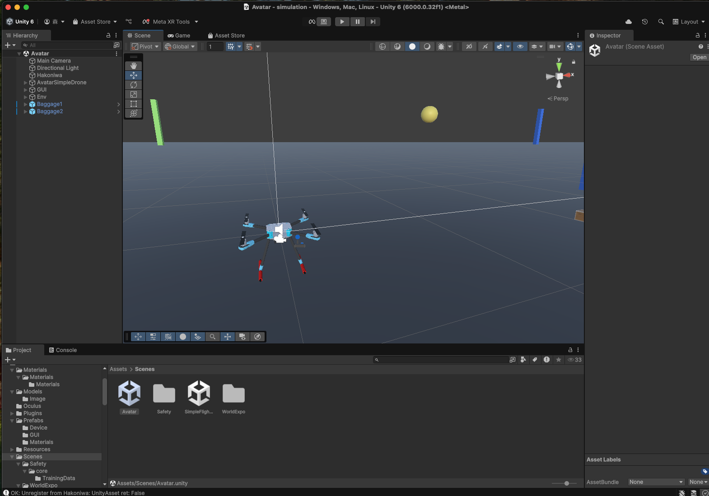
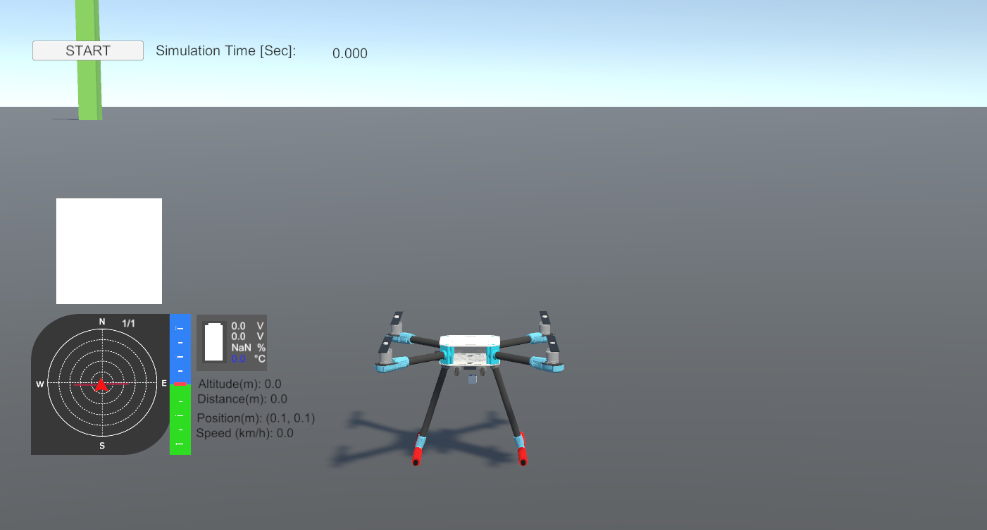
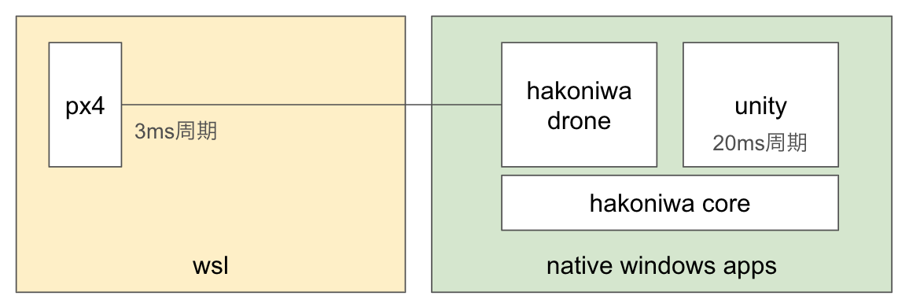
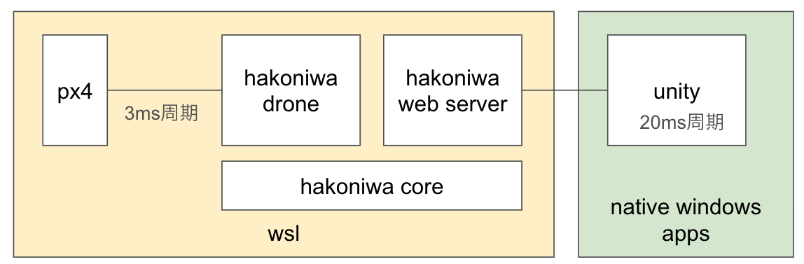

このリポジトリでは、[hakoniwa-px4sim](https://github.com/toppers/hakoniwa-px4sim) を発展させ、拡張性と汎用性を高めたドローンシミュレータのコア機能を提供します。PX4やArdupilot、ロボットシステム(ROS)、さらにはスマホ、XR、Webとの連携も視野に入れた柔軟な設計が特徴です。


# コンセプト

「シミュレーションの世界を飛び出す！」をモットーに、以下の3つを柱としています：

- **シンプルさ**: 誰でも簡単に使えるドローンシミュレータ。  
- **多様性**: ゲーム、教育、研究、ビジネスなど、幅広いアプリケーションに対応。  
- **接続性**: PX4/Ardupilot、Unity、ROS、スマホ、XR、Webとのシームレスな連携。

---

## 「シミュレーションの世界を飛び出す！」とは？

仮想空間の中に閉じず、**現実世界の課題解決や価値創造**を目指したシステム設計を意味します：

### **1. 現実世界との接続**
- **PX4/Ardupilot** や **ROS** と連携し、実機さながらの制御を実現。  
- **物流試験や展示用途**での活用に対応。  
- 仮想シミュレーションの結果を、すぐに実機テストや運用に反映可能。  

### **2. 多様なプラットフォーム対応**
- **スマホ、XR、Web、Unity** など、さまざまなデバイスや環境で動作。  
- ゲームやエンターテインメントコンテンツとしても展開可能。  

### **3. ユーザーの創造性を拡大**
- 教育向けに、学生や学習者が簡単にモデリングや制御工学を体験できるツールを提供。  
- 非専門家でも気軽に利用できる設計で、ゲームや展示会での体験提供にも最適。

---


# ユースケース

- ゲーム: ドローン操縦を手軽に楽しむ。
- エンタメ: 展示用途（例: 万博でのデモ）。
- 訓練: プロ操縦者向けのリアルな動作再現。
- 教育: 制御工学やモデリング学習。
- 研究: 環境や機体のシミュレーション。
- 物流: 実証実験場として活用。


# 特徴

1. C/C++ ベース： 箱庭ドローン・コア機能をCライブラリとして提供し、他の言語での拡張を容易化。
2. [TOPPERS ライセンス](https://www.toppers.jp/license.html)：オープンソースで、商用利用も可能。
3. 複数プラットフォーム対応: Windows, Mac, Linux, WSL2 など主要OSをサポート。
4. 箱庭モードと非箱庭モードのサポート
   - 箱庭あり：ロボットシステム(ROS)や、スマホやXR、Webと連携したシミュレーションが可能。
   - 箱庭なし：ドローンの物理モデルや制御モデルを独立して実行することが可能。PX4/Ardupilotとの連携も可能。

# 依存ライブラリ

## 外部

- [glm](https://github.com/g-truc/glm.git) : 数学ライブラリ。
- [mavlink_c_library_v2](https://github.com/mavlink/c_library_v2.git) : MAVLink通信ライブラリ。
- [nlohmann/json](https://github.com/nlohmann/json.git) : JSON操作ライブラリ。

## 内部

- [hakoniwa-core-cpp-client](https://github.com/toppers/hakoniwa-core-cpp-client.git) : 箱庭シミュレーションとの統合。
- [hakoniwa-ros2pdu](https://github.com/toppers/hakoniwa-ros2pdu.git) : 箱庭PDUとの統合。

# アーキテクチャ


- comm (通信モジュール) : TCP/UDP の通信インタフェース
  - ICommServer API: サーバーサイドの通信機能を提供
    - TCP/UDPプロトコルに対応した通信サーバーの生成
    - エンドポイントでの接続待ち受けと通信管理
    - 使用前には必ずcomm_init()の呼び出しが必要
  - ICommClient API: クライアントサイドの通信機能を提供
    - TCP/UDPプロトコルに対応した通信クライアントの生成
    - 送信元・送信先エンドポイントの指定による通信確立
    - 使用前には必ずcomm_init()の呼び出しが必要
  - ICommIO API: 通信データの送受信機能を提供
    - データの送信・受信操作の抽象化インターフェース
    - TCPでは到達保証とリトライ機能を提供
    - UDPでは高速な通信を実現（到達保証なし）
  - 詳細な API 仕様は[サーバー](docs/api/comm/server/api_comm_server.md)、[クライアント](docs/api/comm/client/api_comm_client.md)、[IO](docs/api/comm/io/api_comm_io.md)を参照
- mavlink (MAVLINK通信) : MAVLINK通信のインタフェース
- physics (物理モデル) :  [機体の物理モデル](docs/api/physics/README-ja.md)
- controller (制御モデル) : 機体の制御モデル
- aircraft (機体モデル) : 物理モデルおよびセンサ/アクチュエータを統合した機体モデル
- service (サービス)
  - aircaft_service (機体サービス) : 箱庭なしで、PX4と連携するためのサービス
  - drone_service (ドローンサービス) : 箱庭なしで、制御/物理モデルを実行するためのサービス
- hakoniwa (箱庭) :  serviceを箱庭に統合したサービス
- logger (ログ) :  機体のログ
- config (コンフィグ) :  ドローンのコンフィグ

# 動作環境

* サポートOS
  * Arm系Mac
  * Windows 11
  * Windows WSL2
  * Ubuntu 22.0.4

* ビルド・テストツール
  * cmake
  * googletest

* 必要なツール類
  * pyenv
    * python: version 3.12.0
      * 3.13以降では動きません。
      * MacOSの場合、homebrewでインストールしたものでは動きません。

# ✅ シミュレータ準備チェックリスト

このシミュレータは、以下のように **箱庭あり／なし** の2モードで利用可能です。  
それぞれに必要な環境やツールが異なるため、事前に以下のチェックリストをご確認ください。

| 項目 | 説明 | 箱庭あり版 | 箱庭なし版 |
|------|------|------------|------------|
| OS環境 | Windows / macOS (Arm対応) / Linux / WSL2 | ✅ | ✅ |
| Python環境 | `Python 3.12.0` を使用 | ✅ | ✅ |
| Unityエディタ | [hakoniwa-unity-drone](https://github.com/hakoniwalab/hakoniwa-unity-drone) の実行に必要 | ✅ | ❌ |
| Unityプロジェクト準備 | `Avatar` シーンを開き、`START`ボタンでシミュ開始 | ✅ | ❌ |
| hakoniwa-core-cpp-client | 箱庭コアとの接続に必須 | ✅ | ❌ |
| QGroundControl | PX4連携時の操作に使用 | ✅ | ✅ |
| MissionPlanner | Ardupilot連携時の操作に使用 | ✅ | ✅ |
| Gameコントローラ | ラジコン操作に使用 (任意) | ✅ | ❌ |
| Drone用Python API | フライトプラン記述に使用可能 | ✅ | ❌ |
| Web連携 (任意) | [hakoniwa-webserver](https://github.com/toppers/hakoniwa-webserver) など | ✅ | ❌ |
| ROS2連携 (任意) | [hakoniwa-ros2pdu](https://github.com/toppers/hakoniwa-ros2pdu) など | ✅ | ❌ |

📌 **備考**
- Pythonは **3.12.0** 固定（それ以外は非対応）
- Mac環境では `homebrew` 経由のPythonでは動作しません
- Unityエディタは、Unity6.0以降が必要です
- Gameコントローラを使う場合は `rc/rc_config/` の設定ファイルを確認してください

---


# 箱庭なしで利用するケース

箱庭なしで利用する場合、箱庭ドローンの物理モデルと制御モデルを独立して実行することが可能です。

補足：箱庭との連携がありませんので、Unityでのビジュアライズはできません。

提供バイナリとしては以下のものがあります。

1. PX4 連携サンプルアプリ(<os名>-aircraft_service_px4)
2. Ardupilot 連携サンプルアプリ(<os名>-aircraft_service_ardupilot)
3. 箱庭ドローンのCUIサンプルアプリ(<os名>-drone_servce_rc)
4. 箱庭ドローンPro Cライブラリ(hako_service_c)

全てクロスプラットフォーム対応しています。リリースページにあるバイナリをダウンロードしてください。

os名は、以下の通りです。

- mac
- win
- linux

## PX4 連携サンプルアプリの利用方法

PX4 連携サンプルアプリを使うと箱庭ドローンシミュレータの物理モデルとPX4を連携することが可能です。

実行方法：
```bash
<os名>-aircraft_service_px4 <IPアドレス> 4560 ./config/drone/px4 
```

この際、PX4を起動することで、PX4と連携することが可能です。

参考：https://github.com/toppers/hakoniwa-px4sim?tab=readme-ov-file#terminal-a

あわせて、QGCと連携することで、遠隔操作が可能です。


## Ardupilot 連携サンプルアプリの利用方法

Ardupilot 連携サンプルアプリを使うと箱庭ドローンシミュレータの物理モデルとArdupilotを連携することが可能です。

実行方法：
```bash
<os名>-aircraft_service_ardupilot <ホストPCのIPアドレス> 9002 9003 ./config/drone/ardupilot 
```

この際、Ardupilotを起動することで、Ardupilotと連携することが可能です。

```bash
./Tools/autotest/sim_vehicle.py -v ArduCopter -f airsim-copter -A "--sim-port-in 9003 --sim-port-out 9002"  --sim-address=<ホストPCのIPアドレス>  --out=udp:<Mission PlannerのIPアドレス>:14550
```

参考：https://github.com/ArduPilot/ardupilot

この際、Mission Plannerと連携することで、遠隔操作が可能です。

## 箱庭ドローンのCUIサンプルアプリの利用方法

箱庭ドローンシミュレータの物理モデルと制御モデルを連携させて、CUIで操作することが可能です。

```bash
service/drone_service_rc 1 config/drone/rc
```

```
 ----- USAGE -----
 ----- STICK -----
|  LEFT  | RIGHT  |
|   w    |   i    |
| a   d  | j   l  |
|   s    |   k    |
 ---- BUTTON ----
 x : radio control button
 p : get position
 r : get attitude
 t : get simtime usec
 f : flip
 b : get battery status
```


実行例：起動直後のログ
```bash
BatteryModelCsvFilePath: ./tmp_battery_model.csv
BatteryModelCsvFilePath does not exist.
Angle rate control is disabled
Angle rate control is disabled
flip_target_time_sec: 0.4
flip_constant_time_sec: 0.1
target_angular_rate_rad_sec: 25.1327
target_angular_rate_delta: 0.167552
target_angular_inc_time_sec: 0.15
target_angular_dec_time_sec: 0.25
INFO: mixer is enabled
timestep_usec: 1000
DroneService::startService: 1000
> Start service
```

この状態で、アームするには、`x`を入力しエンターキーを押下します。

その後、`w`を入力しエンターキーを押下することで、上昇します。

実行例：アームして上昇
```bash
> Start service
x
w
position x=0.0 y=-0.0 z=0.1
position x=0.0 y=-0.0 z=0.2
position x=0.0 y=-0.0 z=0.3
position x=0.0 y=-0.0 z=0.4
position x=0.0 y=-0.0 z=0.5
position x=0.0 y=-0.0 z=0.6
position x=0.0 y=-0.0 z=0.7
position x=0.0 y=-0.0 z=0.8
position x=0.0 y=-0.0 z=0.9
position x=0.0 y=-0.0 z=1.0
position x=0.0 y=-0.0 z=1.1
```

実行例：前進
```bash
i
position x=0.1 y=0.0 z=1.2
position x=0.2 y=0.0 z=1.3
position x=0.3 y=0.0 z=1.3
position x=0.4 y=0.0 z=1.3
position x=0.5 y=0.0 z=1.3
position x=0.6 y=0.0 z=1.3
```

## 箱庭ドローンPro Cライブラリの利用方法

箱庭ドローンシミュレータは、Cライブラリ(hako_service_c)としてバイナリ公開しています。

以下のヘッダファイルをインクルードすることで、ビルド＆リンク可能です。

- include/service/service.h

なお、C APIヘッダは以下です。

- include/service/drone/drone_service_rc_api.h

# 箱庭ありで利用するケース

箱庭ありで利用する場合、箱庭なしの機能に加えて、以下が可能になります。

1. Unity連携: [hakoniwa-unity-drone](https://github.com/hakoniwalab/hakoniwa-unity-drone)を利用
2. デジタルツイン連携: [Zenoh/ROS2箱庭ブリッジ](https://github.com/toppers/hakoniwa-bridge)を利用
3. Mission Planner連携: [MAVLink箱庭ブリッジ](mavlink/bridge/README.md)を利用
4. 箱庭ドローンのAR共有シミュレーション: [箱庭Webサーバー](https://github.com/toppers/hakoniwa-webserver)および[箱庭ARブリッジ](https://github.com/toppers/hakoniwa-ar-bridge)を利用

箱庭あり版の提供バイナリとしては以下のものがあります。

1. PX4 連携のサンプルアプリ(<os名>-main_hako_aircraft_service_px4)
2. Ardupilot 連携のサンプルアプリ(<os名>-main_hako_aircraft_service_ardupilot)
3. 箱庭ドローンのサンプルアプリ(<os名>-main_hako_drone_servce)

全てクロスプラットフォーム対応しています。リリースページにあるバイナリをダウンロードしてください。

os名は、以下の通りです。

- mac
- win
- linux

## 箱庭コア機能のインストール

箱庭あり版を利用する場合は、事前に、[hakoniwa-core-cpp-client](https://github.com/toppers/hakoniwa-core-cpp-client)をインストールしてください。

Windowsの場合は、WSL2で、以下のコマンドを実行してください。

```bash
dd if=/dev/zero of=/mnt/z/mmap/mmap-0x100.bin bs=1M count=5
```

理由：ramdisk上の mmap ファイルのサイズが足りないため。(5MB以上必要)

## Unityエディタの準備

箱庭あり版を利用する場合は、事前に、[hakoniwa-unity-drone](https://github.com/hakoniwalab/hakoniwa-unity-drone)のsimulatinプロジェクトをUnityエディタで開く必要があります。

Unityエディタ起動後、Avatarシーンを開いてください。



このシーンでは、箱庭ドローンの位置と姿勢情報およびローターのPWMデューティ値を受信し、ドローンの動きをビジュアライズします。

箱庭あり版のサンプルアプリと連携することで、Unityエディタ上で箱庭ドローンの動きを確認できます。

また、シミュレーションを開始するには、下図にある START ボタンを押下してください。



## PX4 連携サンプルアプリの利用方法

PX4 連携サンプルアプリを使うと箱庭ドローンシミュレータの物理モデルとPX4を連携することが可能です。

実行方法：
```bash
<os名>-main_hako_aircraft_service_px4 <IPアドレス> 4560 ./config/drone/px4 <path/to/hakoniwa-unity-drone>/simulation/avatar-drone.json
```

* 補足：
  * Windowsの場合、IPアドレスは、Power Shellで、ipconfigを実行したときのWSLのIPアドレスを指定してください。
  * イーサネット アダプター vEthernet (WSL (Hyper-V firewall)):


この際、PX4を起動することで、PX4と連携することが可能です。

参考：https://github.com/toppers/hakoniwa-px4sim?tab=readme-ov-file#terminal-a

あわせて、QGCと連携することで、遠隔操作が可能です。


シミュレーション実行手順：

1. UnityエディタでAvatarシーンを開く。
2. PX4 連携サンプルアプリを起動する。
3. PX4 を起動する。
4. Unityエディタで、STARTボタンを押下する。
5. QGCを起動し、PX4と接続し、遠隔操作を行う。


## Ardupilot 連携サンプルアプリの利用方法

Ardupilot 連携サンプルアプリを使うと箱庭ドローンシミュレータの物理モデルとArdupilotを連携することが可能です。

実行方法：
```bash
<os名>-main_hako_aircraft_service_ardupilot <ホストPCのIPアドレス> 9002 9003 ./config/drone/ardupilot <path/to/hakoniwa-unity-drone>/simulation/avatar-drone.json
```

この際、Ardupilotを起動することで、Ardupilotと連携することが可能です。

```bash
./Tools/autotest/sim_vehicle.py -v ArduCopter -f airsim-copter -A "--sim-port-in 9003 --sim-port-out 9002"  --sim-address=<ホストPCのIPアドレス>  --out=udp:<Mission PlannerのIPアドレス>:14550
```

参考：https://github.com/ArduPilot/ardupilot

この際、Mission Plannerと連携することで、遠隔操作が可能です。

シミュレーション実行手順：

1. UnityエディタでAvatarシーンを開く。
2. Ardupilot 連携サンプルアプリを起動する。
3. Ardupilot を起動する。
4. Unityエディタで、STARTボタンを押下する。
5. Mission Planner を起動し、Ardupilot と接続し、遠隔操作を行う。


## 箱庭ドローンのサンプルアプリの利用方法

箱庭ドローンのサンプルアプリを使うと、箱庭ドローンシミュレータの物理モデルと制御モデルを連携させて、CUIで操作することが可能です。

箱庭ドローンのサンプルアプリは、以下の２種類あります。

1. ラジコン操作のサンプルアプリ
2. フライトプラン操作のサンプルアプリ

### ラジコン操作のサンプルアプリ

お使いのゲームコントローラで箱庭ドローンを操作することが可能です。

実行方法：
```bash
<os名>-main_hako_drone_servce  ./config/drone/rc <path/to/hakoniwa-unity-drone>/simulation/avatar-drone.json
```

この際、ラジコン操作用のPythonスクリプトを利用することで、箱庭ドローンを操作できます。

```bash
python rc/rc-custom.py <path/to/hakoniwa-unity-drone>/simulation/avatar-drone.json rc/rc_config/ps4-control.json
```

最後の引数(ps4-control.json)は、お使いのゲームコントローラに合わせて変更してください。

シミュレーション実行手順：

1. UnityエディタでAvatarシーンを開く。
2. 箱庭ドローンのサンプルアプリを起動する。
3. Unityエディタで、STARTボタンを押下する。
4. ラジコン操作用のPythonスクリプトを起動する。
5. ゲームコントローラで、箱庭ドローンを操作する。


### フライトプラン操作のサンプルアプリ

箱庭ドローンの [Python API](drone_api/libs/README.md) を利用して、フライトプランを実行することが可能です。

フライトプラン操作のサンプルアプリ：[sample.py](drone_api/rc/sample.py)

実行方法：
```bash
<os名>-main_hako_drone_servce  ./config/drone/api <path/to/hakoniwa-unity-drone>/simulation/avatar-drone.json
```

この際、フライトプラン操作用のPythonスクリプトを利用することで、箱庭ドローンを操作できます。

```bash
python rc/sample.py <path/to/hakoniwa-unity-drone>/simulation/avatar-drone.json
```

シミュレーション実行手順：

1. UnityエディタでAvatarシーンを開く。
2. 箱庭ドローンのサンプルアプリを起動する。
3. Unityエディタで、STARTボタンを押下する。
4. フライトプラン操作用のPythonスクリプトを起動する。

# TIPS
## Windows で 箱庭あり版PX4/Ardupilot連携する場合について

Windowsで PX4/Ardupilot連携する場合、WSLとネイティブアプリ間で高頻度な通信が発生します(3ms毎に通信)。



そのため、シミュレーション速度が非常に遅くなる場合があります（体感で３−４倍程度遅くなる）。

シミュレーション速度を改善する方法として、シミュレーション構成を以下のようにすることで、改善できます。




シミュレーション実行手順：

1. [UnityエディタでWebAvatarシーンを開く。](#UnityエディタでWebAvatarシーンを開く)
2. [WSLで、初期セットアップ](#wslで初期セットアップ)
3. [WSLで、PX4 を起動する。](#wslでpx4-を起動する)
4. [WSLで、PX4 連携サンプルアプリを起動する。](#wslでpx4-連携サンプルアプリを起動する)
5. [WSLで、箱庭Webサーバーを起動する。](#wslで箱庭webサーバーを起動する)
6. [WSLで、箱庭シミュレーションを開始する。](#wslで箱庭シミュレーションを開始する)
7. UnityエディタのWebAvatarシーンのPlayボタンをクリック。
8. QGCを起動し、PX4と接続し、遠隔操作を行う。

### UnityエディタでWebAvatarシーンを開く。

ヒエラルキービューの`HakoniwaWeb` をクリックし、インスペクタビューの`Server Uri` のIPアドレスをWSLのIPアドレスとしてください。


### WSLで、初期セットアップ

#### 箱庭コマンドのパスを通す。

環境変数 `PATH` に、箱庭コマンドのパスを通す必要があります。

設定例：
```bash
export PATH=$PATH:/usr/local/bin/hakoniwa
```

必要に応じて、`~/.bashrc` や `~/.zshrc` に追記してください。

```bash
echo 'export PATH=$PATH:/usr/local/bin/hakoniwa' >> ~/.bashrc
source ~/.bashrc
```

#### WSLのファイルシステムに移動し、空プロジェクトディレクトリを作成する

ここでは、プロジェクト名を `project`としていますが、任意の英字で構いません。

```bash
cd ~
mkdir project
cd project
```

なお、後述するリポジトリは、すべて project 直下にクローンしてください。

#### hakoniwa-drone-coreのクローン

事前に、hakoniwa-drone-core をクローンしてください。

```bash
git clone --recursive https://github.com/toppers/hakoniwa-drone-core.git
```

また、最新のリリースから lnx.zip をダウンロードしhakoniwa-drone-core 直下に解凍してください。

#### hakoniwa-unity-droneのクローン

事前に、hakoniwa-unity-drone をクローンしてください。

```bash
git clone --recursive https://github.com/hakoniwalab/hakoniwa-unity-drone.git
```

### WSLで、PX4 を起動する。

```bash
cd hakoniwa-px4sim/px4/PX4-Autopilot
```

```bash
bash ../sim/simstart.bash
```

成功するとこうなります。

```
tmori@WinHako:~/project/hakoniwa-px4sim/px4/PX4-Autopilot$ bash ../sim/simstart.bash
Linux WinHako 5.15.167.4-microsoft-standard-WSL2 #1 SMP Tue Nov 5 00:21:55 UTC 2024 x86_64 x86_64 x86_64 GNU/Linux
INFO: SINGLE INSTANCE MODE
[0/1] launching px4 none_iris (SYS_AUTOSTART=10016)

______  __   __    ___
| ___ \ \ \ / /   /   |
| |_/ /  \ V /   / /| |
|  __/   /   \  / /_| |
| |     / /^\ \ \___  |
\_|     \/   \/     |_/

px4 starting.

INFO  [px4] startup script: /bin/sh etc/init.d-posix/rcS 0
env SYS_AUTOSTART: 10016
INFO  [param] selected parameter default file parameters.bson
INFO  [param] importing from 'parameters.bson'
INFO  [parameters] BSON document size 411 bytes, decoded 411 bytes (INT32:13, FLOAT:7)
INFO  [param] selected parameter backup file parameters_backup.bson
INFO  [dataman] data manager file './dataman' size is 7868392 bytes
INFO  [init] PX4_SIM_HOSTNAME: 127.0.0.1
INFO  [simulator_mavlink] using TCP on remote host 127.0.0.1 port 4560
WARN  [simulator_mavlink] Please ensure port 4560 is not blocked by a firewall.
INFO  [simulator_mavlink] Resolved host '127.0.0.1' to address: 127.0.0.1
INFO  [simulator_mavlink] Waiting for simulator to accept connection on TCP port 4560
```

### WSLで、PX4 連携サンプルアプリを起動する。

```bash
lnx/linux-main_hako_aircraft_service_px4 127.0.0.1 4560 ./config/drone/px4 <path/to/hakoniwa-unity-drone>/simulation/avatar-drone.json
```

成功するとこうなります。

```
tmori@WinHako:~/project/hakoniwa-drone-core$ ./lnx/linux-main_hako_aircraft_service_px4 127.0.01 4560 config/drone/px4 ../hakoniwa-unity-drone/simulation/webavatar.json
BatteryModelCsvFilePath: ./tmp_battery_model.csv
BatteryModelCsvFilePath does not exist.
INFO: aircraft_index=0
MavLinkService initialized
asset_name: drone
conductor start
conductor start done
simulator register
asset_name = drone
config_path = ../hakoniwa-unity-drone/simulation/webavatar.json
INFO: hako_conductor thread start
Robot: Drone, PduWriter: Drone_motor
channel_id: 0 pdu_size: 112
INFO: Drone create_lchannel: logical_id=0 real_id=0 size=112
Robot: Drone, PduWriter: Drone_pos
channel_id: 1 pdu_size: 72
INFO: Drone create_lchannel: logical_id=1 real_id=1 size=72
Robot: Drone, PduWriter: Drone_disturb
channel_id: 3 pdu_size: 56
INFO: Drone create_lchannel: logical_id=3 real_id=2 size=56
Robot: Drone, PduWriter: Drone_battery
channel_id: 4 pdu_size: 56
INFO: Drone create_lchannel: logical_id=4 real_id=3 size=56
Robot: Drone, PduWriter: Drone_velocity
channel_id: 5 pdu_size: 72
INFO: Drone create_lchannel: logical_id=5 real_id=4 size=72
Robot: Drone, PduWriter: Drone_drone_cmd_takeoff
channel_id: 6 pdu_size: 88
INFO: Drone create_lchannel: logical_id=6 real_id=5 size=88
Robot: Drone, PduWriter: Drone_drone_cmd_move
channel_id: 7 pdu_size: 104
INFO: Drone create_lchannel: logical_id=7 real_id=6 size=104
Robot: Drone, PduWriter: Drone_drone_cmd_land
channel_id: 8 pdu_size: 88
INFO: Drone create_lchannel: logical_id=8 real_id=7 size=88
Robot: Drone, PduWriter: Drone_hako_cmd_game
channel_id: 9 pdu_size: 160
INFO: Drone create_lchannel: logical_id=9 real_id=8 size=160
Robot: Drone, PduWriter: Drone_hako_cmd_camera
channel_id: 10 pdu_size: 44
INFO: Drone create_lchannel: logical_id=10 real_id=9 size=44
Robot: Drone, PduWriter: Drone_hako_cmd_camera_move
channel_id: 11 pdu_size: 64
INFO: Drone create_lchannel: logical_id=11 real_id=10 size=64
Robot: Drone, PduWriter: Drone_hako_cmd_magnet_holder
channel_id: 14 pdu_size: 40
INFO: Drone create_lchannel: logical_id=14 real_id=11 size=40
Robot: Drone, PduWriter: Drone_impulse
channel_id: 2 pdu_size: 216
INFO: Drone create_lchannel: logical_id=2 real_id=12 size=216
Robot: Drone, PduWriter: Drone_hako_camera_data
channel_id: 12 pdu_size: 1002992
INFO: Drone create_lchannel: logical_id=12 real_id=13 size=1002992
Robot: Drone, PduWriter: Drone_hako_cmd_camera_info
channel_id: 13 pdu_size: 56
INFO: Drone create_lchannel: logical_id=13 real_id=14 size=56
Robot: Drone, PduWriter: Drone_hako_status_magnet_holder
channel_id: 15 pdu_size: 32
INFO: Drone create_lchannel: logical_id=15 real_id=15 size=32
Robot: Drone, PduWriter: Drone_lidar_points
channel_id: 16 pdu_size: 177424
INFO: Drone create_lchannel: logical_id=16 real_id=16 size=177424
Robot: Drone, PduWriter: Drone_lidar_pos
channel_id: 17 pdu_size: 72
INFO: Drone create_lchannel: logical_id=17 real_id=17 size=72
INFO: asset(drone) is registered.
HakoniwaPduAccessor::init()
HakoniwaPduAccessor::create_map()
reader: robot_name = Drone, channel_id = 2, pdu_size = 216
reader: robot_name = Drone, channel_id = 12, pdu_size = 1002992
reader: robot_name = Drone, channel_id = 13, pdu_size = 56
reader: robot_name = Drone, channel_id = 15, pdu_size = 32
reader: robot_name = Drone, channel_id = 16, pdu_size = 177424
reader: robot_name = Drone, channel_id = 17, pdu_size = 72
reader: robot_name = Drone, channel_id = 0, pdu_size = 112
reader: robot_name = Drone, channel_id = 1, pdu_size = 72
reader: robot_name = Drone, channel_id = 3, pdu_size = 56
reader: robot_name = Drone, channel_id = 4, pdu_size = 56
reader: robot_name = Drone, channel_id = 5, pdu_size = 72
reader: robot_name = Drone, channel_id = 6, pdu_size = 88
reader: robot_name = Drone, channel_id = 7, pdu_size = 104
reader: robot_name = Drone, channel_id = 8, pdu_size = 88
reader: robot_name = Drone, channel_id = 9, pdu_size = 160
reader: robot_name = Drone, channel_id = 10, pdu_size = 44
reader: robot_name = Drone, channel_id = 11, pdu_size = 64
reader: robot_name = Drone, channel_id = 14, pdu_size = 40
writer: robot_name = Drone, channel_id = 0, pdu_size = 112
writer: robot_name = Drone, channel_id = 1, pdu_size = 72
writer: robot_name = Drone, channel_id = 3, pdu_size = 56
writer: robot_name = Drone, channel_id = 4, pdu_size = 56
writer: robot_name = Drone, channel_id = 5, pdu_size = 72
writer: robot_name = Drone, channel_id = 6, pdu_size = 88
writer: robot_name = Drone, channel_id = 7, pdu_size = 104
writer: robot_name = Drone, channel_id = 8, pdu_size = 88
writer: robot_name = Drone, channel_id = 9, pdu_size = 160
writer: robot_name = Drone, channel_id = 10, pdu_size = 44
writer: robot_name = Drone, channel_id = 11, pdu_size = 64
writer: robot_name = Drone, channel_id = 14, pdu_size = 40
writer: robot_name = Drone, channel_id = 2, pdu_size = 216
writer: robot_name = Drone, channel_id = 12, pdu_size = 1002992
writer: robot_name = Drone, channel_id = 13, pdu_size = 56
writer: robot_name = Drone, channel_id = 15, pdu_size = 32
writer: robot_name = Drone, channel_id = 16, pdu_size = 177424
writer: robot_name = Drone, channel_id = 17, pdu_size = 72
simulator register done
HakoniwaDroneService::registerService() done
INFO: lockStep=1
INFO: deltaTimeUsec=3000
INFO: AircraftService startService wait for connection : 0
INFO: AircraftService startService is returned : 0
INFO: COMMAND_LONG ack sended: ret = 1
INFO: AircraftService started
WAIT START
```

### WSLで、箱庭シミュレーションを開始する。

```bash
hako-cmd start
```

成功すると、PX4のログが以下のようになります。

```
:
INFO  [simulator_mavlink] Waiting for simulator to accept connection on TCP port 4560
INFO  [simulator_mavlink] Simulator connected on TCP port 4560.
ERROR [simulator_mavlink] poll timeout 0, 111
ERROR [simulator_mavlink] poll timeout 0, 111
INFO  [lockstep_scheduler] setting initial absolute time to 1747721032882577 us
WARN  [vehicle_angular_velocity] no gyro selected, using sensor_gyro_fifo:0 1310988
INFO  [commander] LED: open /dev/led0 failed (22)
WARN  [health_and_arming_checks] Preflight Fail: ekf2 missing data
INFO  [mavlink] mode: Normal, data rate: 4000000 B/s on udp port 18570 remote port 14550
INFO  [mavlink] mode: Onboard, data rate: 4000000 B/s on udp port 14580 remote port 14540
INFO  [mavlink] mode: Onboard, data rate: 4000 B/s on udp port 14280 remote port 14030
INFO  [mavlink] mode: Gimbal, data rate: 400000 B/s on udp port 13030 remote port 13280
INFO  [logger] logger started (mode=all)
INFO  [logger] Start file log (type: full)
INFO  [logger] [logger] ./log/2025-05-20/06_03_53.ulg
INFO  [logger] Opened full log file: ./log/2025-05-20/06_03_53.ulg
* MPC_XY_CRUISE: curr: 20.0000 -> new: 3.5000
INFO  [mavlink] MAVLink only on localhost (set param MAV_{i}_BROADCAST = 1 to enable network)
INFO  [mavlink] MAVLink only on localhost (set param MAV_{i}_BROADCAST = 1 to enable network)
INFO  [px4] Startup script returned successfully
pxh> INFO  [tone_alarm] home set
INFO  [mavlink] partner IP: 172.31.0.1
INFO  [commander] Ready for takeoff!
```

### WSLで、箱庭Webサーバーを起動する。

```bash
cd hakoniwa-unity-drone/hakoniwa-webserver
```

```bash
python -m server.main --asset_name WebServer --config_path ../simulation/webavatar.json --delta_time_usec 20000
```

成功すると、こうなります。

```
(venv) tmori@WinHako:~/project/hakoniwa-unity-drone/hakoniwa-webserver$ python -m server.main --asset_name WebServer --config_path ../simulation/webavatar.json --delta_time_usec 20000
INFO: start http server
INFO: start websocket server
run webserver
set event loop on asyncio
Starting WebSocket server...
INFO: Success for external initialization.
append_list(pub_pdus) : Drone 2 impulse
pdu create: Drone 2 216
WebSocket server started on ws://0.0.0.0:8765
append_list(pub_pdus) : Drone 12 hako_camera_data
pdu create: Drone 12 1002992
append_list(pub_pdus) : Drone 13 hako_cmd_camera_info
pdu create: Drone 13 56
append_list(pub_pdus) : Drone 15 hako_status_magnet_holder
Starting HTTP server on port 8000...
pdu create: Drone 15 32
append_list(pub_pdus) : Drone 16 lidar_points
pdu create: Drone 16 177424
append_list(pub_pdus) : Drone 17 lidar_pos
pdu create: Drone 17 72
append_list(pub_pdus) : Drone 0 motor
======== Running on http://localhost:8080 ========
(Press CTRL+C to quit)
pdu create: Drone 0 112
append_list(pub_pdus) : Drone 1 pos
pdu create: Drone 1 72
append_list(pub_pdus) : Drone 3 disturb
pdu create: Drone 3 56
append_list(pub_pdus) : Drone 4 battery
pdu create: Drone 4 56
append_list(pub_pdus) : Drone 5 velocity
pdu create: Drone 5 72
append_list(pub_pdus) : Drone 6 drone_cmd_takeoff
pdu create: Drone 6 88
append_list(pub_pdus) : Drone 7 drone_cmd_move
pdu create: Drone 7 104
append_list(pub_pdus) : Drone 8 drone_cmd_land
pdu create: Drone 8 88
append_list(pub_pdus) : Drone 9 hako_cmd_game
pdu create: Drone 9 160
append_list(pub_pdus) : Drone 10 hako_cmd_camera
pdu create: Drone 10 44
append_list(pub_pdus) : Drone 11 hako_cmd_camera_move
pdu create: Drone 11 64
append_list(pub_pdus) : Drone 14 hako_cmd_magnet_holder
pdu create: Drone 14 40
append_list(sub_pdus) : Drone 0 motor
pdu create: Drone 0 112
append_list(sub_pdus) : Drone 1 pos
pdu create: Drone 1 72
append_list(sub_pdus) : Drone 3 disturb
pdu create: Drone 3 56
append_list(sub_pdus) : Drone 4 battery
pdu create: Drone 4 56
append_list(sub_pdus) : Drone 5 velocity
pdu create: Drone 5 72
append_list(sub_pdus) : Drone 6 drone_cmd_takeoff
pdu create: Drone 6 88
append_list(sub_pdus) : Drone 7 drone_cmd_move
pdu create: Drone 7 104
append_list(sub_pdus) : Drone 8 drone_cmd_land
pdu create: Drone 8 88
append_list(sub_pdus) : Drone 9 hako_cmd_game
pdu create: Drone 9 160
append_list(sub_pdus) : Drone 10 hako_cmd_camera
pdu create: Drone 10 44
append_list(sub_pdus) : Drone 11 hako_cmd_camera_move
pdu create: Drone 11 64
append_list(sub_pdus) : Drone 14 hako_cmd_magnet_holder
pdu create: Drone 14 40
append_list(sub_pdus) : Drone 2 impulse
pdu create: Drone 2 216
append_list(sub_pdus) : Drone 12 hako_camera_data
pdu create: Drone 12 1002992
append_list(sub_pdus) : Drone 13 hako_cmd_camera_info
pdu create: Drone 13 56
append_list(sub_pdus) : Drone 15 hako_status_magnet_holder
pdu create: Drone 15 32
append_list(sub_pdus) : Drone 16 lidar_points
pdu create: Drone 16 177424
append_list(sub_pdus) : Drone 17 lidar_pos
pdu create: Drone 17 72
LOADED: PDU DATA
WARNING: on_simulation_step_async() took longer than delta_time_usec: 21.79 ms
```

## WSL で、Ardupilot を起動すると Warning, time moved backwards. Restarting timer.が出た時の対処方法

この警告は、Ardupilot SITL がシステム時刻の逆行を検出した際に表示されるメッセージです。

### 対処方法

WSL2の時刻同期を手動で実行

```bash
sudo hwclock -s
```

chrony による時刻同期

```bash
sudo apt update
sudo apt install chrony
sudo systemctl start chronyd
sudo systemctl enable chronyd
```

WSL2を再起動する

