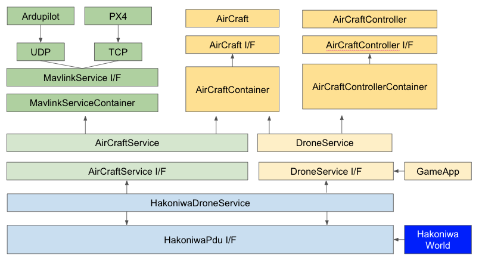

このリポジトリでは、[hakoniwa-px4sim](https://github.com/toppers/hakoniwa-px4sim) を発展させ、拡張性と汎用性を高めたドローンシミュレータのコア機能を提供します。PX4やArdupilot、ロボットシステム(ROS)、さらにはスマホ、XR、Webとの連携も視野に入れた柔軟な設計が特徴です。

# コンセプト

「シミュレーションの世界を飛び出す！」をモットーに、以下の3つを柱としています：

- **シンプルさ**: 誰でも簡単に使えるドローンシミュレータ。  
- **多様性**: ゲーム、教育、研究、ビジネスなど、幅広いアプリケーションに対応。  
- **接続性**: PX4/Ardupilot、Unity、ROS、スマホ、XR、Webとのシームレスな連携。

---

## 「シミュレーションの世界を飛び出す！」とは？

仮想空間の中に閉じず、**現実世界の課題解決や価値創造**を目指したシステム設計を意味します：

### **1. 現実世界との接続**
- **PX4/Ardupilot** や **ROS** と連携し、実機さながらの制御を実現。  
- **物流試験や展示用途**での活用に対応。  
- 仮想シミュレーションの結果を、すぐに実機テストや運用に反映可能。  

### **2. 多様なプラットフォーム対応**
- **スマホ、XR、Web、Unity** など、さまざまなデバイスや環境で動作。  
- ゲームやエンターテインメントコンテンツとしても展開可能。  

### **3. ユーザーの創造性を拡大**
- 教育向けに、学生や学習者が簡単にモデリングや制御工学を体験できるツールを提供。  
- 非専門家でも気軽に利用できる設計で、ゲームや展示会での体験提供にも最適。

---

# ユースケース

- ゲーム: ドローン操縦を手軽に楽しむ。
- エンタメ: 展示用途（例: 万博でのデモ）。
- 訓練: プロ操縦者向けのリアルな動作再現。
- 教育: 制御工学やモデリング学習。
- 研究: 環境や機体のシミュレーション。
- 物流: 実証実験場として活用。

# 特徴

1. C/C++ ベース： 箱庭ドローン・コア機能をCライブラリとして提供し、他の言語での拡張を容易化。
2. [TOPPERS ライセンス](https://www.toppers.jp/license.html)：オープンソースで、商用利用も可能。
3. 複数プラットフォーム対応: Windows, Mac, Linux, WSL2 など主要OSをサポート。
4. 箱庭モードと非箱庭モードのサポート
   - 箱庭あり：ロボットシステム(ROS)や、スマホやXR、Webと連携したシミュレーションが可能。
   - 箱庭なし：ドローンの物理モデルや制御モデルを独立して実行することが可能。PX4/Ardupilotとの連携も可能。

# 依存ライブラリ

## 外部

- [glm](https://github.com/g-truc/glm.git) : 数学ライブラリ。
- [mavlink_c_library_v2](https://github.com/mavlink/c_library_v2.git) : MAVLink通信ライブラリ。
- [nlohmann/json](https://github.com/nlohmann/json.git) : JSON操作ライブラリ。

## 内部

- [hakoniwa-core-cpp-client](https://github.com/toppers/hakoniwa-core-cpp-client.git) : 箱庭シミュレーションとの統合。
- [hakoniwa-ros2pdu](https://github.com/toppers/hakoniwa-ros2pdu.git) : 箱庭PDUとの統合。

# アーキテクチャ

- comm (通信モジュール) : TCP/UDP の通信インタフェース
- mavlink (MAVLINK通信) : MAVLINK通信のインタフェース
- physics (物理モデル) :  [機体の物理モデル](src/physics/README.md)
- controller (制御モデル) : 機体の制御モデル
- aircraft (機体モデル) : 物理モデルおよびセンサ/アクチュエータを統合した機体モデル
- service (サービス)
  - aircaft_service (機体サービス) : 箱庭なしで、PX4と連携するためのサービス
  - drone_service (ドローンサービス) : 箱庭なしで、制御/物理モデルを実行するためのサービス
- hakoniwa (箱庭) :  serviceを箱庭に統合したサービス
- logger (ログ) :  機体のログ
- config (コンフィグ) :  ドローンのコンフィグ

# 動作環境

* サポートOS
  * Arm系Mac
  * Windows 11
  * Windows WSL2
  * Ubuntu 22.0.4

* ビルド・テストツール
  * cmake
  * googletest

* 必要なツール類
  * pyenv
    * python: version 3.12.0
      * 3.13以降では動きません。
      * MacOSの場合、homebrewでインストールしたものでは動きません。

# インストール方法

工事中...

