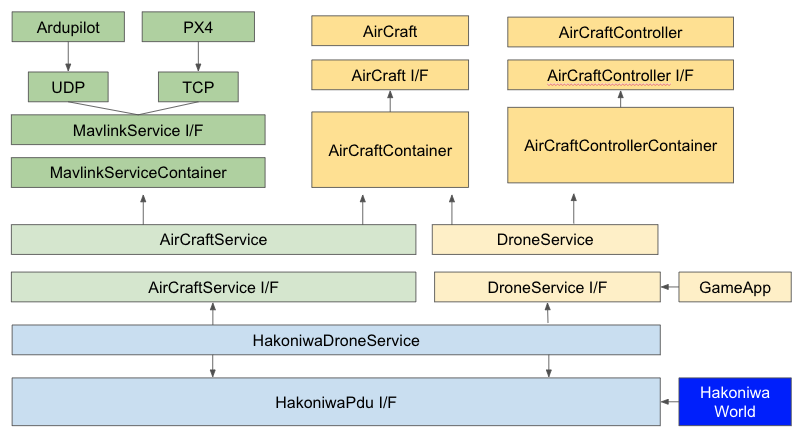

このリポジトリでは、[hakoniwa-px4sim](https://github.com/toppers/hakoniwa-px4sim) を引き継ぎ、より拡張性・汎用性を高めたドローンシミュレータのコア機能を提供します。


# コンセプト

ドローンシミュレータを「手軽に」作れて、PX4/Ardupilot、ロボットシステム(ROS)や、スマホやXR、Webの世界にもつながる！

# ユースケース

- ドローン・ゲーム向け（手軽にドローン操縦を楽しむ）
- ドローン・エンタメ向け（万博出展が第一弾）
- ドローン・訓練向け（リアルな動きと外部環境下でのプロの操縦訓練）
- ドローン・教育向け（モデリング教育/制御工学教育として）
- ドローン・研究向け（様々な機体や外部環境下でのシミュレーション）
- ドローン・物流ビジネス向け（手軽に試せる実証実験場として）

# 特徴

1. C/C++ ベース： 箱庭ドローン・コア機能をCライブラリとして提供し、他の言語での拡張を容易化。
2. [TOPPERS ライセンス](https://www.toppers.jp/license.html)：オープンソースで、商用利用も可能。
3. 複数プラットフォーム対応: Windows, Mac, Linux, WSL2 など主要OSをサポート。
4. 箱庭モードと非箱庭モードのサポート
   - 箱庭あり：ロボットシステム(ROS)や、スマホやXR、Webと連携したシミュレーションが可能。
   - 箱庭なし：ドローンの物理モデルや制御モデルを独立して実行することが可能。PX4/Ardupilotとの連携も可能。

# 依存ライブラリ

## 外部

- [glm](https://github.com/g-truc/glm.git) : 数学ライブラリ。
- [mavlink_c_library_v2](https://github.com/mavlink/c_library_v2.git) : MAVLink通信ライブラリ。
- [nlohmann/json](https://github.com/nlohmann/json.git) : JSON操作ライブラリ。

## 内部

- [hakoniwa-core-cpp-client](https://github.com/toppers/hakoniwa-core-cpp-client.git) : 箱庭シミュレーションとの統合。
- [hakoniwa-ros2pdu](https://github.com/toppers/hakoniwa-ros2pdu.git) : 箱庭PDUとの統合。

# アーキテクチャ



- comm (通信モジュール) : TCP/UDP の通信インタフェース
- mavlink (MAVLINK通信) : MAVLINK通信のインタフェース
- physics (物理モデル) :  [機体の物理モデル](src/physics/README.md)
- controller (制御モデル) : 機体の制御モデル
- aircraft (機体モデル) : 物理モデルおよびセンサ/アクチュエータを統合した機体モデル
- service (サービス)
  - aircaft_service (機体サービス) : 箱庭なしで、PX4と連携するためのサービス
  - drone_service (ドローンサービス) : 箱庭なしで、制御/物理モデルを実行するためのサービス
- hakoniwa (箱庭) :  serviceを箱庭に統合したサービス
- logger (ログ) :  機体のログ
- config (コンフィグ) :  ドローンのコンフィグ

# 動作環境

* サポートOS
  * Arm系Mac
  * Windows 11
  * Windows WSL2
  * Ubuntu 22.0.4

* ビルド・テストツール
  * cmake
  * googletest

# インストール方法

## 箱庭コア機能をインストール

[hakoniwa-core-cpp-client](https://github.com/toppers/hakoniwa-core-cpp-client) をインストールしてください。

## 箱庭ドローンコア機能をインストール

```
git clone --recursive https://github.com/toppers/hakoniwa-drone-core.git
```


```
cd hakoniwa-drone-core/src
```

```
mkdir cmake-build
```

```
cd cmake-build
```

```
cmake ..
```

```
make
```


# アプリケーションの説明

サンプルアプリケーションとして、以下を用意しています。

- src/main_for_sample
  - service
    - 箱庭なしで、ドローンシミュレーションを実行するサンプルアプリケーションです。
    - main_aircraft_service.cpp
        - 箱庭なしで、PX4と連携するサンプルアプリケーションです。
    - main_drone_service2.cpp
        - 箱庭なしで、制御/物理モデルを実行するサンプルアプリケーションです。
  - hakoniwa
    - 箱庭ありで、ドローンシミュレーションを実行するサンプルアプリケーションです。
    - main_hako_aircraft_service.cpp
        - 箱庭ありで、PX4と連携するサンプルアプリケーションです。
    - main_hako_drone_service.cpp
        - 箱庭ありで、制御/物理モデルを実行するサンプルアプリケーションです。

# シミュレーションの実行方法

```
cd src/cmake-build
```

## 箱庭なしで、ドローンシミュレーションを実行する

### PX4と連携するサンプルアプリケーションを実行する

1. QGroundControl(QGC) を起動。

2. MAVLINK通信する物理モデルを起動する。

```
 ./main_for_sample/service/aircraft_service 1 ../../config/drone/px4
```

3. PX4 SITLを起動する。

```
bash ../sim/simstart.bash
```
(PX4 SITLは、[hakoniwa-px4simのリポジトリ](https://github.com/toppers/hakoniwa-px4sim/tree/main/px4)を利用してください)

4. QGCから操作する。

### 制御/物理モデルを実行するサンプルアプリケーションを実行する

1. パラメータファイルを設定する。

```
export HAKO_CONTROLLER_PARAM_FILE=../../config/controller/param-api-mixer.txt
```

2. ドローンサービスを実行。

```
 ./main_for_sample/service/drone_service 1 ../../config/drone/ap
```

成功するとこうなります。

```
> Start service
```


3. 操作コマンドで、ドローンを操作できます。

```
Usage: takeoff <height> | land | move <x> <y> <z> | quit
```

## 箱庭ありで、ドローンシミュレーションを実行する

本シミュレーションでは、Unityを利用しますので、事前に、[hakoniwa-unity-drone-model](https://github.com/toppers/hakoniwa-unity-drone-model) または v2.8.0以上で[リリース](https://github.com/toppers/hakoniwa-unity-drone-model/releases)されているUnityアプリケーション（Python API連携アプリ）をインストールしてください。

### PX4と連携するサンプルアプリケーションを実行する


1. QGroundControl(QGC) を起動。

2. MAVLINK通信する物理モデルを起動する。

```
 ./main_for_sample/hakoniwa/hako_aircraft_service ../../config/drone/px4 ../../../hakoniwa-unity-drone-model/custom.json
```

(hakoniwa-unity-drone-modelが本リポジトリと同じ階層にある想定の実行コマンドです)

3. PX4 SITLを起動する。

```
bash ../sim/simstart.bash
```
(PX4 SITLは、[hakoniwa-px4simのリポジトリ](https://github.com/toppers/hakoniwa-px4sim/tree/main/px4)を利用してください)

4. Unityアプリケーションを起動し、STARTボタンを押下する。

5. QGCから操作する。

### 制御/物理モデルを実行するサンプルアプリケーションを実行する


1. パラメータファイルを設定する。

```
export HAKO_CONTROLLER_PARAM_FILE=../../config/controller/param-api-mixer.txt
```

2. ドローンサービスを実行。


Python API連携アプリを実行する場合：

```
 ./main_for_sample/hakoniwa/hako_drone_service ../../config/drone/api ../../../hakoniwa-unity-drone-model/custom.json
```

ラジコン操作する場合：

```
 ./main_for_sample/hakoniwa/hako_drone_service ../../config/drone/rc ../../../hakoniwa-unity-drone-model/custom.json
```

3. Unityアプリケーションを起動し、STARTボタンを押下する。

4. Pythonアプリケーションを実行し、ドローンを操作する。


