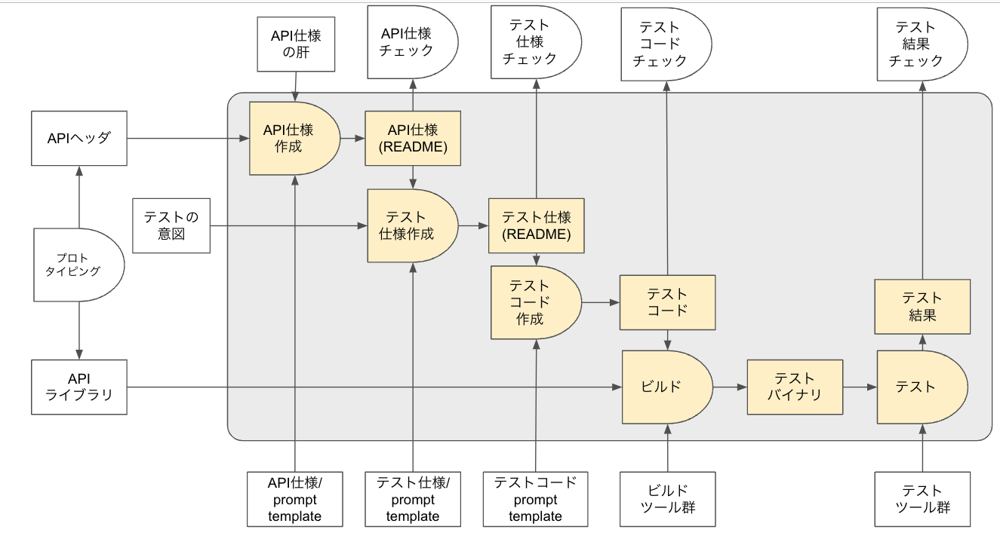

# ドキュメント作成方針

ドキュメントは基本的に、AIのサポートで作成することを指向する。

上図の灰色部分は、AIのサポートで作成する部分である。

それ以外の部分は、人間が思考して作成する部分である。

## 管理している成果物

AI 生成フローの中で人間が用意する成果物と、その管理場所を以下にまとめます。

| 成果物 | 説明 | 保存場所 |
|--------|------|---------|
| API・テスト仕様プロンプト | 各 API の仕様書やテスト関連の指示をまとめた AGENTS ファイル | `docs/prompts/*/AGENTS.md`  例: [comm I/O 用](prompts/comm/io/AGENTS.md) |
| テンプレート類 | 生成物のフォーマット定義 | `docs/prompts` |
| API ヘッダ | API 定義を記述したヘッダファイル | `include/*.hpp`  例: [comm.hpp](../include/comm.hpp) |

プロンプトはコンポーネント毎に `docs/prompts/<コンポーネント>` に整理し、
共通で利用するテンプレートは `docs/prompts` 直下に配置しています。

その他のテンプレートや資料は順次整備中です (工事中)。

# API ドキュメント
- [comm](api/comm/api_comm.md)
- [mavlink](api/mavlink/api_mavlink.md)

# テスト仕様
- [comm](test/comm)

