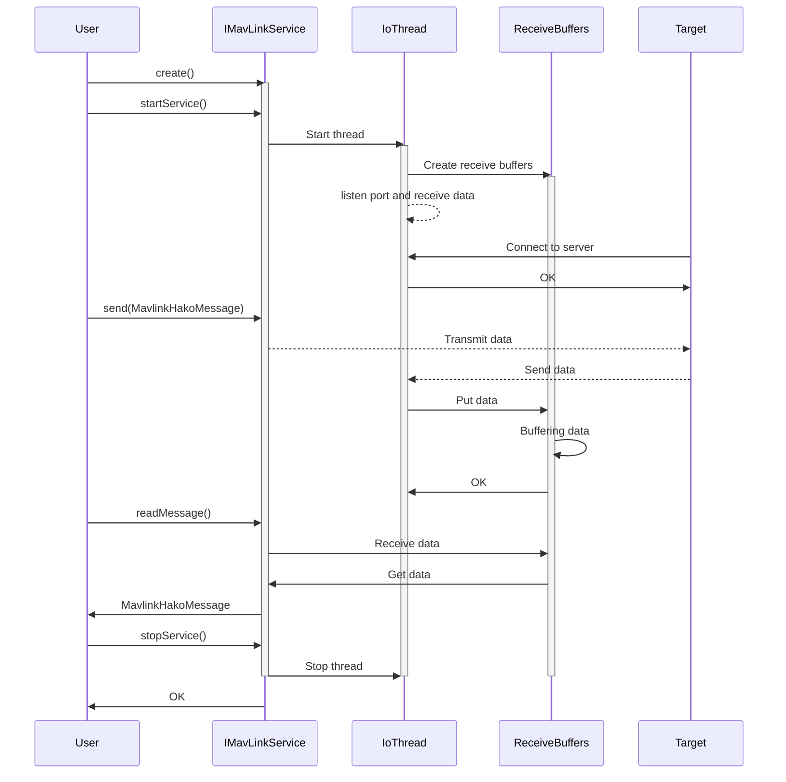

# Mavlink.hpp クラス設計情報

## クラス概要

### MavlinkServiceIoType
MavlinkServiceIoTypeは、Mavlink通信におけるデータ送受信の通信方式を定義する列挙型クラスです。TCPまたはUDPとしての動作を指定します。

- TCP: TCP/IPプロトコルを使用した通信方式
- UDP: UDP/IPプロトコルを使用した通信方式

### MavlinkMsgType
MavlinkMsgTypeは、Mavlinkプロトコルで使用されるメッセージタイプを定義します。このクラスは、Mavlinkメッセージの種類や識別に使用されます。

メッセージタイプ：

- HEARTBEAT
- LONG
- COMMAND_ACK
- HIL_SENSOR
- HIL_STATE_QUATERNION
- SYSTEM_TIME
- HIL_GPS
- HIL_ACTUATOR_CONTROLS

### MavlinkHakoMessage
MavlinkHakoMessageは、Mavlinkメッセージをラップするクラスです。このクラスは、メッセージのデータ構造を提供し、Mavlinkプロトコルにおける通信処理を簡素化します。

サポートしているメッセージ：

- Hako_HakoHilSensor
- Hako_HakoHilActuatorControls
- Hako_HakoHilStateQuaternion
- Hako_HakoHilGps

Hako_xxx は、箱庭プロジェクトで使用されるMavlinkメッセージの名前空間です。
ヘッダファイル一式は、以下で一般公開されています。

https://github.com/toppers/hakoniwa-ros2pdu/tree/main/pdu/types/hako_mavlink_msgs

### IMavlinkCommEndpointType
IMavlinkCommEndpointTypeは、Mavlink通信のエンドポイントを抽象化したインターフェースクラスです。TCP/UDPのサーバーやクライアントエンドポイントを実装する際の基盤となります。

### IMavLinkService
IMavLinkServiceは、Mavlink通信サービスのインターフェースを提供する抽象クラスです。このインターフェースを実装することで、異なる通信方式やプロトコルの処理を統一的に扱うことができます。

### MavLinkServiceContainer
MavLinkServiceContainerは、Mavlink通信サービスの管理を行うクラスです。このクラスは、IMavLinkServiceインスタンスの生成、登録、管理を提供します。

## クラス図

## シーケンス図

IMavLinkServiceのインスタンス生成、エンドポイントの設定、データ送受信のシーケンス図を示します(MavLinkServiceContainerを利用することもできますが、ここでは省略します)。

## API リファレンスへの参照
以下のクラスについてのAPIリファレンスを参照してください：

- IMavLinkService
- MavLinkServiceContainer

ドキュメントはプロジェクトの `docs/api/comm/api_comm.md` を参照してください。

