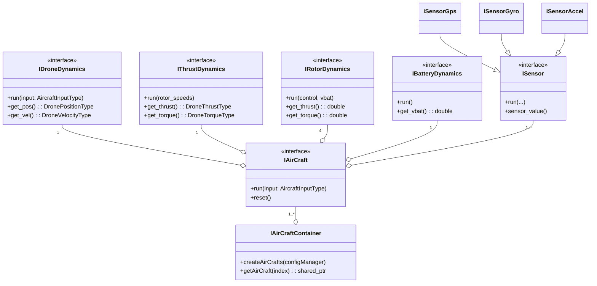
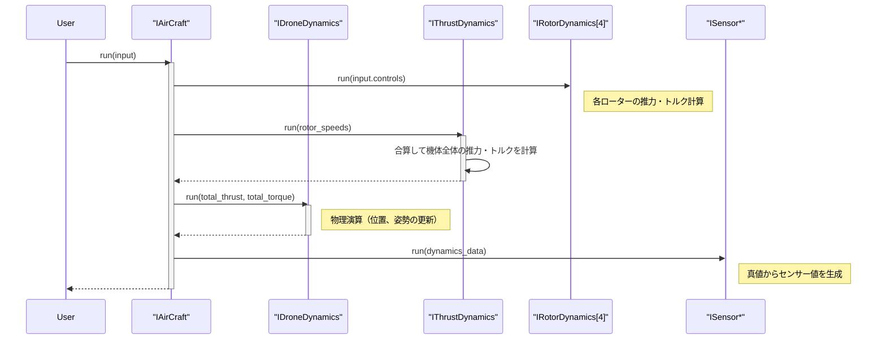

# 全体アーキテクチャ

[architecture](architecture.md) 

# Aircraft API ドキュメント

## 概要

### 名前空間: `hako::aircraft`

`aircraft` コンポーネントは、ドローンの物理的な実体をシミュレーション上で表現する中核的な役割を担います。機体の運動を計算する物理モデル、ローターやバッテリーといった動力源、そして機体の状態を観測する各種センサーを統合し、一つの「機体 (Aircraft)」として抽象化します。

---

### クラス設計

`IAirCraft` インターフェースを中心に、機体を構成する各要素が個別のインターフェースとして定義され、動的に組み合わされる設計になっています。

#### **主要インターフェース**

-   **`IAirCraft`**:
    -   **役割:** 機体全体を統合する中心的なクラス。機体の物理モデル (`IDroneDynamics`)、動力源 (`IRotorDynamics`, `IThrustDynamics`, `IBatteryDynamics`)、センサー群 (`ISensor*`) を保持し、シミュレーションの1ステップを実行します。
-   **`IAirCraftContainer`**:
    -   **役割:** `config` 情報に基づき、複数の `IAirCraft` インスタンスを生成・管理するファクトリ兼コンテナです。
-   **`IDroneDynamics`**:
    -   **役割:** 機体の並進運動と回転運動を計算する物理モデルのインターフェース。外部から与えられた力（推力、トルク、外乱）に基づき、機体の位置、速度、姿勢を更新します。
-   **`IRotorDynamics`**:
    -   **役割:** 個々のローターの振る舞いをモデル化します。制御信号（PWMデューティ比）とバッテリー電圧を入力とし、そのローターが発生させる推力とトルクを計算します。
-   **`IThrustDynamics`**:
    -   **役割:** 全てのローターが発生させる推力とトルクを機体全体の座標系で統合し、合力と合モーメントを算出します。
-   **`IBatteryDynamics`**:
    -   **役割:** 各コンポーネントからの電流要求に基づき、バッテリーの電圧降下や残量をシミュレートします。
-   **`ISensor` (`ISensorAcceleration`, `ISensorGps`, etc.)**:
    -   **役割:** 各種センサーを抽象化するインターフェース群。物理モデルから得られる「真値」に、ノイズの付加やサンプリングといったセンサー固有の特性を加えて、センサーからの「観測値」を生成します。

---

## クラス図

## シーケンス図

`IAirCraft` の `run` メソッドが呼び出されてから、機体の状態が1ステップ更新されるまでの流れを示します。

## 座標系とデータ型

本コンポーネント、ひいてはプロジェクト全体で利用される主要なデータ型と座標系は `primitive_types.hpp` に定義されています。

-   **座標系:**
    -   **地上座標系 (Ground Frame):** NED (North-East-Down) を採用。
    -   **機体座標系 (Body Frame):** FRD (Front-Right-Down) を採用。
-   **主要なデータ型:**
    -   `DronePositionType`: 位置 (m, NED)
    -   `DroneVelocityType`: 速度 (m/s, NED)
    -   `DroneEulerType`: オイラー角 (rad, NED)
    -   `DroneVelocityBodyFrameType`: 機体座標系での速度 (m/s, FRD)
    -   `DroneAngularVelocityBodyFrameType`: 機体座標系での角速度 (rad/s, FRD)

詳細は `primitive_types.hpp` のコメントを参照してください。