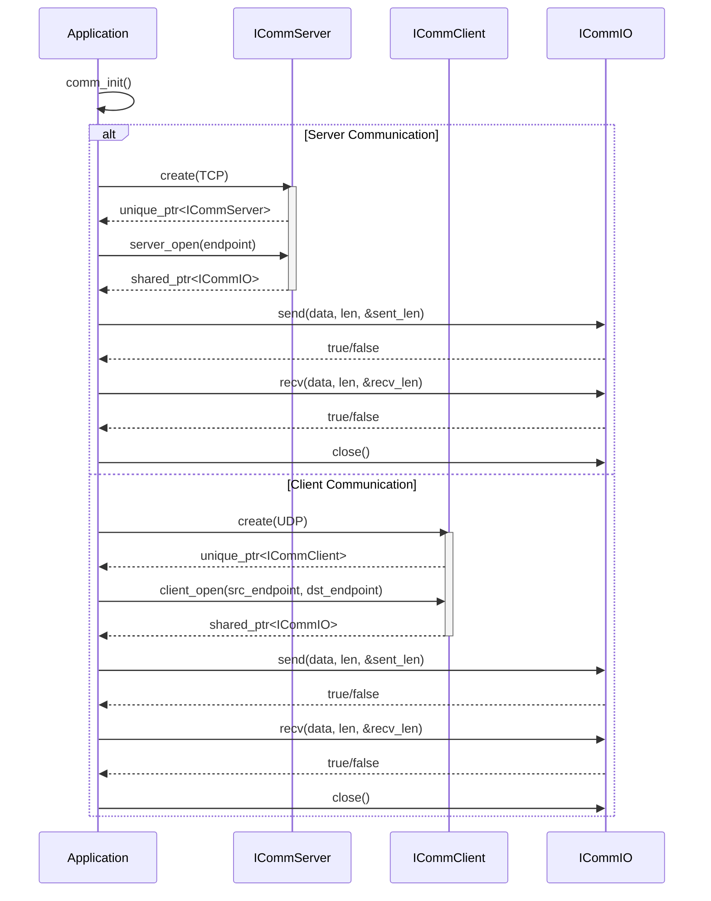

# COMM API ドキュメント

## 1. 概要

`comm` コンポーネントは、TCP/UDP の通信インタフェースを提供します。アプリケーションは、このAPIを通じてネットワーク通信を抽象化された形で利用できます。

名前空間: `hako::comm`

## 2. 主要なクラス、構造体、列挙型

-   **`ICommServer`**: サーバーサイドの通信機能を提供するインターフェースです。指定されたエンドポイントで接続を待ち受け、`ICommIO` インターフェースを介して通信を行います。
-   **`ICommClient`**: クライアントサイドの通信機能を提供するインターフェースです。指定された送信元・送信先エンドポイント間で接続を確立し、`ICommIO` インターフェースを介して通信を行います。
-   **`ICommIO`**: 通信データの送受信機能を提供する抽象インターフェースです。`send`、`recv`、`close` メソッドを提供します。
-   **`CommIoType`**: 通信のI/Oタイプ（TCPまたはUDP）を定義する列挙型です。
-   **`ICommEndpointType`**: 通信エンドポイント（IPアドレスとポート番号）を定義する構造体です。
-   **`comm_init()`**: `comm` モジュールを使用する前に呼び出す必要がある初期化関数です。

## 3. クラス図

```mermaid
classDiagram
    direction LR

    class ICommServer {
        <<interface>>
        +static create(CommIoType type): unique_ptr<ICommServer>
        +server_open(ICommEndpointType *endpoint): shared_ptr<ICommIO>
    }

    class ICommClient {
        <<interface>>
        +static create(CommIoType type): unique_ptr<ICommClient>
        +client_open(ICommEndpointType *src, ICommEndpointType *dst): shared_ptr<ICommIO>
    }

    class ICommIO {
        <<interface>>
        +send(const char* data, int datalen, int* send_datalen): bool
        +recv(char* data, int datalen, int* recv_datalen): bool
        +close(): bool
    }

    enum CommIoType {
        TCP,
        UDP,
        NUM
    }

    class ICommEndpointType {
        +const char* ipaddr
        +int portno
    }

    ICommServer ..> ICommIO : creates
    ICommClient ..> ICommIO : creates
    ICommServer -- CommIoType
    ICommClient -- CommIoType
    ICommServer -- ICommEndpointType
    ICommClient -- ICommEndpointType

```

## 4. シーケンス図



## 5. APIリファレンス

-   [サーバーAPI](/docs/architecture/comm/server/api_comm_server.md)
-   [クライアントAPI](/docs/architecture/comm/client/api_comm_client.md)
-   [IO API](/docs/architecture/comm/io/api_comm_io.md)