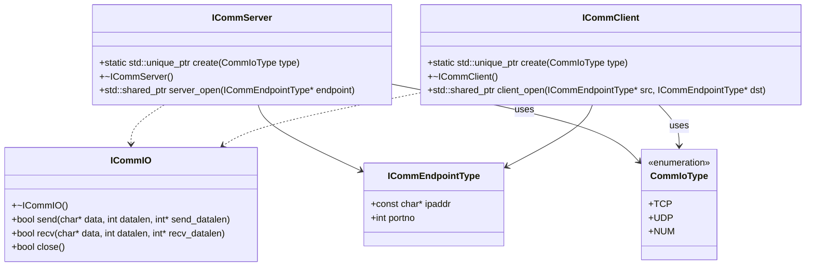

# COMM API ドキュメント

`comm` コンポーネントは、TCP/UDP の通信インタフェースを提供します。アプリケーションは、このAPIを通じてネットワーク通信を抽象化された形で利用できます。

## クラス設計

### 名前空間: `hako::comm`
通信機能を提供するライブラリ全体をまとめる名前空間。TCPやUDPを使用したデータ通信を実現するための機能を提供。

---

### 型

#### **CommIoType**
通信方式を定義する列挙型。サーバーやクライアントがTCPまたはUDPを選択可能。

#### **ICommEndpointType**
通信エンドポイント（IPアドレスとポート番号）を表現する構造体。通信相手を特定する情報を保持。

---

### クラス

#### **ICommIO**
送受信操作を定義する基本通信インターフェース。
- **役割:** データの送信・受信を抽象化。
- **特徴:** プロトコル（TCP/UDP）に依存しない共通のインターフェースを提供。

#### **ICommServer**
通信サーバーの抽象化クラス。
- **役割:** サーバーを生成し、指定されたエンドポイントで接続を待ち受ける。
- **特徴:** 接続を受け入れた後、通信を管理する`ICommIO`インスタンスを生成。

#### **ICommClient**
通信クライアントの抽象化クラス。
- **役割:** クライアントを生成し、指定されたサーバーエンドポイントに接続する。
- **特徴:** 接続後の通信を管理する`ICommIO`インスタンスを生成。

---

### 関数

#### **comm_init()**
通信ライブラリの初期化を行うグローバル関数。
- **役割:** ライブラリ使用前に必要なリソースを初期化。

---

### クラス間の関係

- **`ICommServer`と`ICommClient`**
  - 通信のエントリーポイントとして機能。
  - サーバーは接続を受け入れ、クライアントは接続を試みる。
  - **`create()`メソッド**でインスタンスを生成し、**`open()`メソッド**で通信を開始。

- **`ICommIO`**
  - サーバーとクライアント間のデータ送受信を担当。
  - サーバーでは`server_open`で、クライアントでは`client_open`で生成される。

## クラス図



## シーケンス

```mermaid
sequenceDiagram
    participant Client
    participant Server
    participant ClientCommIO
    participant ServerCommIO

    Server ->> comm_init(): Initialize communication
    Server ->> ICommServer::create(): Create server instance
    Server ->> ICommServer::server_open(): Open server endpoint
    activate ServerCommIO
    Note right of ServerCommIO: ServerCommIO created
    ServerCommIO ->> ServerCommIO: Waiting for incoming data
    Note right of ServerCommIO: ServerCommIO is now listening

    Client ->> comm_init(): Initialize communication
    Client ->> ICommClient::create(): Create client instance
    Client ->> ICommClient::client_open(): Connect to server
    activate ClientCommIO
    Note right of ClientCommIO: ClientCommIO created

    ClientCommIO ->> ServerCommIO: Send data
    ServerCommIO ->> ServerCommIO: Process received data
    Note right of ServerCommIO: Data received successfully
    ServerCommIO ->> ClientCommIO: Send response

    deactivate ServerCommIO
    deactivate ClientCommIO
```


## APIリファレンス

- [ICommServer](server/api_comm_server.md)
- [ICommClient](client/api_comm_client.md)
- [ICommIO](io/api_comm_io.md)
