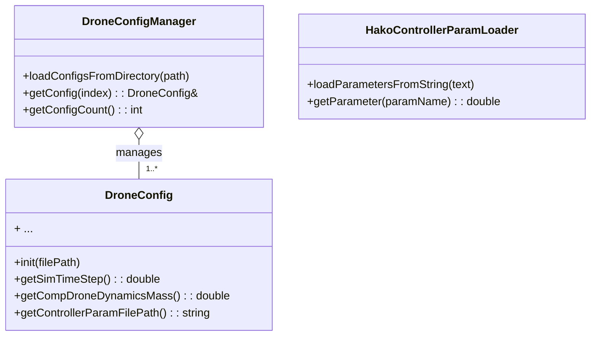
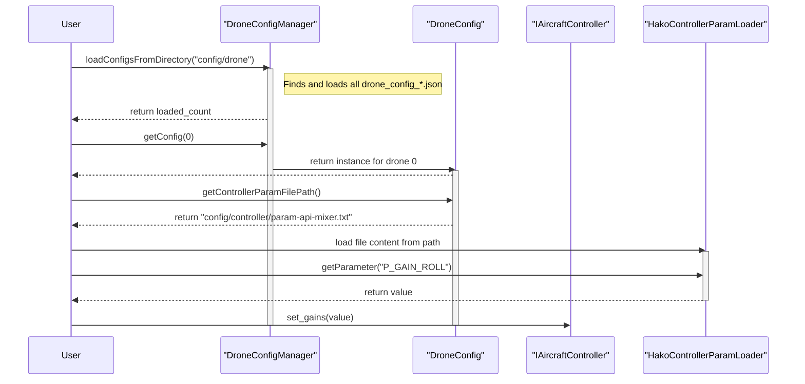

# Config API ドキュメント

## 概要

### 名前空間: `hako::config`

`config` コンポーネントは、シミュレーション対象となるドローンの物理特性、センサー、コントローラーなどのパラメータを設定ファイルから読み込み、管理する機能を提供します。

設定情報の管理は、主に2つの仕組みで行われます。

1.  **JSONベースの設定 (`DroneConfig`)**: ドローン全体の詳細な設定をJSONファイルで管理します。
2.  **テキストベースのパラメータ (`HakoControllerParamLoader`)**: 主にコントローラーのPIDゲインなど、調整頻度の高いパラメータをシンプルなテキストファイルで管理します。

---

### クラス設計

#### **`DroneConfig`**

-   **役割:** 一機分のドローンに関する全設定情報を保持するクラスです。`drone_config_*.json` ファイルをパースし、各種パラメータへのアクセスを提供します。
-   **主な設定項目:**
    -   シミュレーション設定（タイムステップ、ログ出力先など）
    -   機体の物理パラメータ（質量、慣性、外形など）
    -   センサーの種別やノイズ設定
    -   コントローラーの種別やパラメータファイルのパス
    -   MAVLink通信設定

#### **`DroneConfigManager`**

-   **役割:** 複数の `DroneConfig` インスタンスを管理するコンテナです。指定されたディレクトリから、命名規則 (`drone_config_*.json`) に従う設定ファイルを全て読み込み、インデックス番号で各機体の設定情報にアクセスする手段を提供します。

#### **`HakoControllerParamLoader`**

-   **役割:** `param-api-mixer.txt` のような、`パラメータ名 値` の形式で記述されたテキストファイルをロードするためのシンプルなパーサーです。主にコントローラーのチューニングパラメータを外部ファイルから読み込むために使用されます。

---

## クラス図

## 利用シーケンス

一般的な利用シーケンスとして、`DroneConfigManager` が `config/drone` ディレクトリから複数のJSONファイルを読み込み、各コンポーネントがそこから必要な情報を取得する流れを示します。

## 関連ドキュメント

より詳細なパラメータの意味については、以下のドキュメントを参照してください。

-   [機体パラメータ (aircraft-param.md)](aircraft-param.md)
-   [制御パラメータ (controller-param.md)](controller-param.md)
