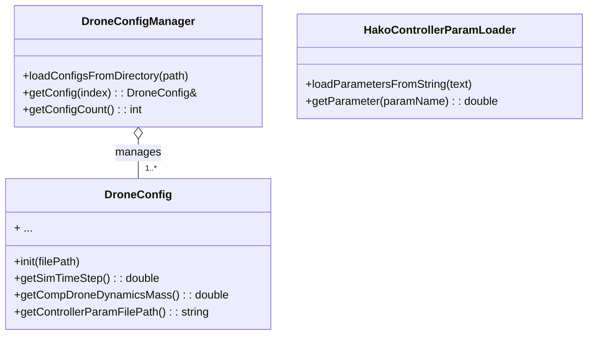
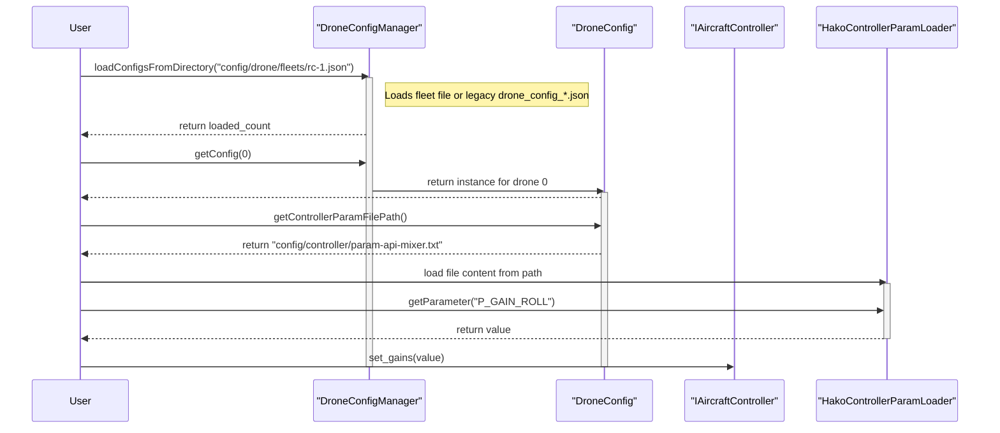

# Config API ドキュメント

## 概要

### 名前空間: `hako::config`

`config` コンポーネントは、シミュレーション対象となるドローンの物理特性、センサー、コントローラーなどのパラメータを設定ファイルから読み込み、管理する機能を提供します。

設定情報の管理は、主に2つの仕組みで行われます。

1.  **JSONベースの設定 (`DroneConfig`)**: ドローン全体の詳細な設定をJSONファイルで管理します。
2.  **テキストベースのパラメータ (`HakoControllerParamLoader`)**: 主にコントローラーのPIDゲインなど、調整頻度の高いパラメータをシンプルなテキストファイルで管理します。

---

### クラス設計

#### **`DroneConfig`**

-   **役割:** 一機分のドローンに関する全設定情報を保持するクラスです。`drone_config_*.json` ファイルをパースし、各種パラメータへのアクセスを提供します。
-   **主な設定項目:**
    -   シミュレーション設定（タイムステップ、ログ採取方式、ログ出力先など）
    -   機体の物理パラメータ（質量、慣性、外形など）
    -   センサーの種別やノイズ設定
    -   コントローラーの種別やパラメータファイルのパス
    -   service 動作モード（legacy / rpc）
    -   MAVLink通信設定

#### **`DroneConfigManager`**

-   **役割:** 複数の `DroneConfig` インスタンスを管理するコンテナです。legacy 形式では指定ディレクトリから、命名規則 (`drone_config_*.json`) に従う設定ファイルを読み込みます。新方式では fleet file を入口として受け取り、type 定義を解決した上で `DroneConfig` 群へ再構築します。新方式では fleet file から `serviceConfigPath` も解決し、箱庭 service 初期化側へ渡せます。

#### **`HakoControllerParamLoader`**

-   **役割:** `param-api-mixer.txt` のような、`パラメータ名 値` の形式で記述されたテキストファイルをロードするためのシンプルなパーサーです。主にコントローラーのチューニングパラメータを外部ファイルから読み込むために使用されます。

---

## クラス図

```mermaid
classDiagram
    class DroneConfigManager {
        +loadConfigsFromDirectory(path)
        +getConfig(index) : DroneConfig&
        +getConfigCount() : int
    }
    class DroneConfig {
        +init(filePath)
        +getSimTimeStep() : double
        +getCompDroneDynamicsMass() : double
        +getControllerParamFilePath() : string
        + ...
    }
    class HakoControllerParamLoader {
        +loadParametersFromString(text)
        +getParameter(paramName) : double
    }
    DroneConfigManager o-- "1..*" DroneConfig : manages
```

## 利用シーケンス

一般的な利用シーケンスとして、`DroneConfigManager` が legacy directory または fleet file を読み込み、各コンポーネントがそこから必要な情報を取得する流れを示します。

```mermaid
sequenceDiagram
    participant User
    participant ConfigManager as "DroneConfigManager"
    participant DroneConfig as "DroneConfig"
    participant Controller as "IAircraftController"
    participant ParamLoader as "HakoControllerParamLoader"

    User->>ConfigManager: loadConfigsFromDirectory("config/drone/fleets/rc-1.json")
    activate ConfigManager
    Note right of ConfigManager: Loads fleet file or legacy drone_config_*.json
    ConfigManager-->>User: return loaded_count

    User->>ConfigManager: getConfig(0)
    ConfigManager->>DroneConfig: return instance for drone 0
    activate DroneConfig
    DroneConfig-->>User:

    User->>DroneConfig: getControllerParamFilePath()
    DroneConfig-->>User: return "config/controller/param-api-mixer.txt"

    User->>ParamLoader: load file content from path
    activate ParamLoader
    User->>ParamLoader: getParameter("P_GAIN_ROLL")
    ParamLoader-->>User: return value
    deactivate ParamLoader

    User->>Controller: set_gains(value)

    deactivate DroneConfig
    deactivate ConfigManager
```

## 関連ドキュメント

より詳細なパラメータの意味については、以下のドキュメントを参照してください。

-   [機体パラメータ (aircraft-param.md)](aircraft-param.md)
-   [制御パラメータ (controller-param.md)](controller-param.md)
-   [新 config スキーマ (fleet-schema.md)](fleet-schema.md)
-   [新 config データ構造 (fleet-data-structures.md)](fleet-data-structures.md)
-   [新 config 内部設計 (fleet-internal-design.md)](fleet-internal-design.md)
-   [新 config path resolver 方針 (fleet-path-resolver.md)](fleet-path-resolver.md)
-   [新 config resolver 方針 (fleet-resolver.md)](fleet-resolver.md)
-   [新 config validator C API (fleet-validator-api.md)](fleet-validator-api.md)
-   [新 config validator checklist (fleet-validator-checklist.md)](fleet-validator-checklist.md)
-   [新 config validation ルール (fleet-validation-rules.md)](fleet-validation-rules.md)
-   [新 config validator 方針 (fleet-validator.md)](fleet-validator.md)

## 新方式の入口

新方式では、fleet file を直接指定する。

例:

- `config/drone/fleets/rc-1.json`
- `config/drone/fleets/api-1.json`

legacy 形式では、従来どおり `drone_config_*.json` を含むディレクトリ、または単一の `drone_config_0.json` を指定できる。

## 新方式での service 設定

箱庭 service 制御を使う場合は、fleet file に `serviceConfigPath` を持たせ、type 定義側で `controller.serviceMode = "rpc"` を指定する。

例:

- fleet file: `config/drone/fleets/api-1.json`
- type file: `config/drone/fleets/types/api.json`
- service file: `config/drone/fleets/services/api-1-service.json`

## logging 設定の方針

ログ設定は単純な ON/OFF ではなく、ログ採取方式を選択する方針とする。

想定 mode:

- `csv`: 現行の CSV ログ出力
- `none`: ログを採取しない
- `memory`: 将来拡張用

`none` は 100 台同時 Sim のような大規模構成を主な利用対象とし、`csv` は既存のデバッグ・評価用途を維持するための mode とする。
