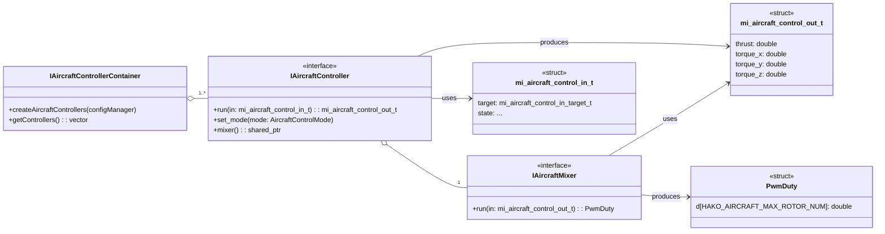

# Controller API ドキュメント

## 概要

### 名前空間: `hako::controller`

`controller` コンポーネントは、ドローンの頭脳として機能し、目標の姿勢や位置を維持するための制御計算を行います。現在のドローンの状態と目標値を入力として受け取り、機体を安定させるための推力とトルクを算出します。

---

### クラス設計

#### **`IAircraftController`**

-   **役割:** 制御ロジックの中核をなすインターフェースです。`run` メソッドで、センサー等から得られる現在の機体状態 (`mi_aircraft_control_in_t`) と目標値に基づき、機体全体に加えるべき推力とトルク (`mi_aircraft_control_out_t`) を計算します。
-   **制御モード:**
    -   `ATTI`: 目標の姿勢（ロール、ピッチ、ヨーレート）を維持するモード。
    -   `GPS`: 目標の地理座標（緯度、経度、高度）を維持するモード。

#### **`IAircraftMixer`**

-   **役割:** `IAircraftController` が算出した抽象的な「推力」と「トルク」を、物理的な4つ（またはそれ以上）のローターそれぞれの回転数（PWMデューティ比）に変換する責務を持ちます。制御指令をアクチュエーターの動作に変換する重要な役割です。

#### **`IAircraftControllerContainer`**

-   **役割:** `DroneConfigManager` から設定情報を読み込み、複数の `IAircraftController` インスタンスを生成・管理するコンテナクラスです。

#### **主要なデータ構造**

-   **`mi_aircraft_control_in_t`**: コントローラーへの入力。目標値（姿勢、位置など）と、現在の機体状態（速度、角速度など）が含まれます。
-   **`mi_aircraft_control_out_t`**: コントローラーからの出力。機体全体に作用させるべき目標の推力と3軸トルクで構成されます。
-   **`PwmDuty`**: ミキサーからの最終的な出力。各ローターのPWMデューティ比を格納します。

---

## クラス図

## シーケンス図

コントローラーが機体状態を受け取り、PWM信号を生成するまでの一連の流れを示します。

