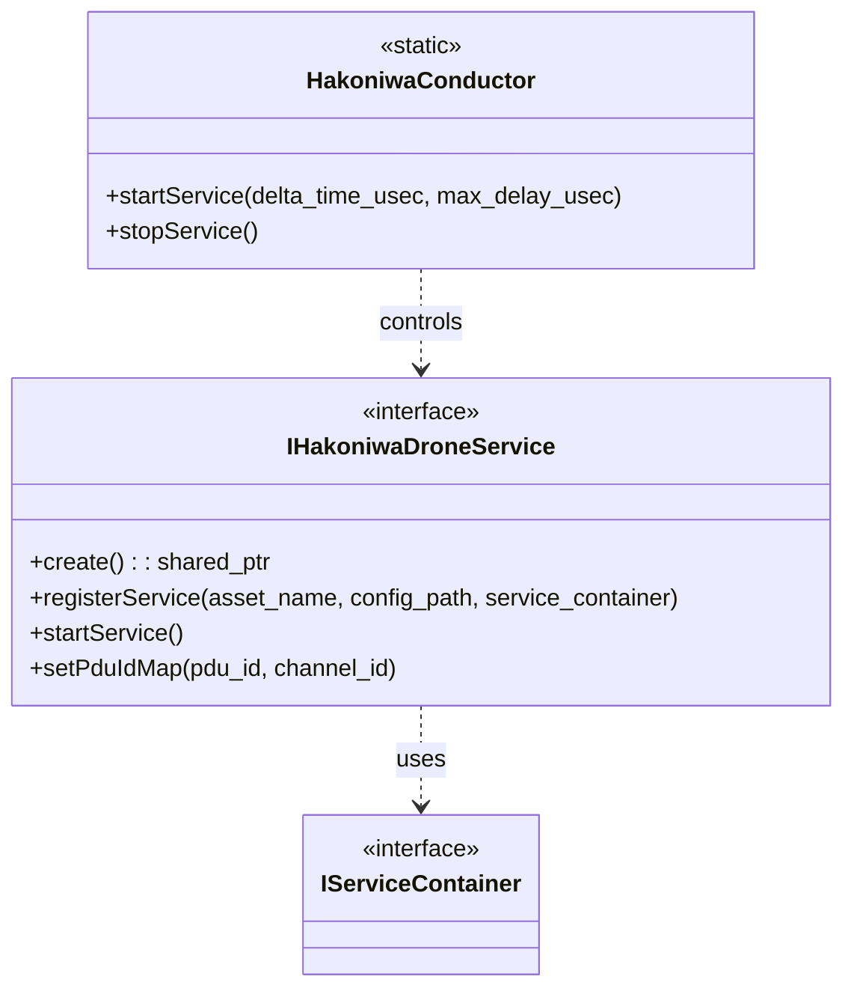
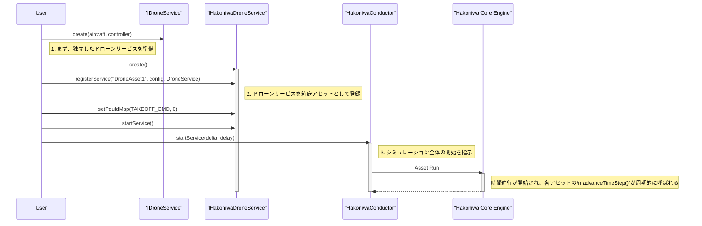

# Hakoniwa API ドキュメント

## 概要

### 名前空間: `hako::drone`

`hakoniwa` コンポーネントは、これまで見てきた `service` レイヤーを、箱庭シミュレーションフレームワークに統合し、シミュレーション全体のライフサイクルを管理する最上位のレイヤーです。

ドローンサービスを箱庭の「アセット」として登録し、シミュレーション全体の時間進行を同期させる役割を担います。

---

### クラス設計

#### **`IHakoniwaDroneService`**

-   **役割:** `IDroneService` や `IAircraftServiceContainer` といったサービスコンテナを、箱庭シミュレーションのアセットとして登録するためのインターフェースです。
-   **主な機能:**
    -   `registerService`: サービスコンテナを、指定したアセット名 (`asset_name`) で箱庭に登録します。
    -   `setPduIdMap`: サービスが利用するPDU (`ServicePduDataIdType`) と、箱庭の物理的な通信チャネルIDとをマッピングします。
    -   `startService`: 登録されたアセットのシミュレーションを開始します。

#### **`HakoniwaConductor`**

-   **役割:** 箱庭シミュレーション全体の実行を司る「指揮者」です。静的クラスとして実装され、グローバルなシミュレーションの開始と停止を制御します。
-   **主な機能:**
    -   `startService`: 登録されている全てのアセットのシミュレーションを一斉に開始します。これにより、箱庭シミュレータのコアエンジンが時間の進行を開始します。
    -   `stopService`: シミュレーションを停止します。

---

## クラス図

## シーケンス図

ドローンサービスを準備し、箱庭アセットとして登録、シミュレーションを開始するまでの一連の流れを示します。

