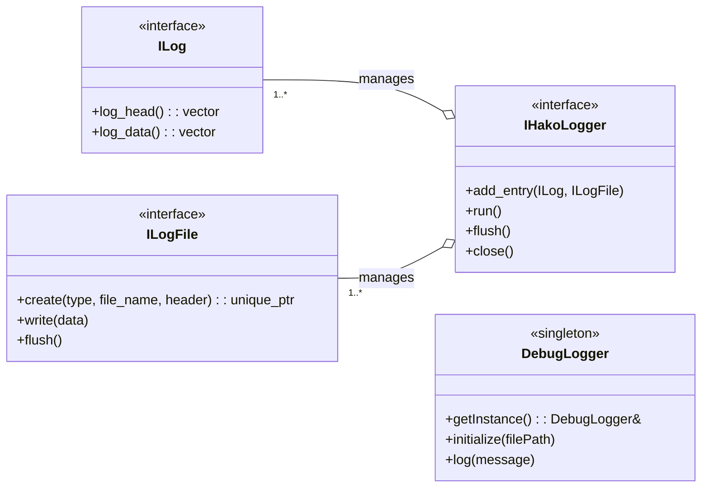
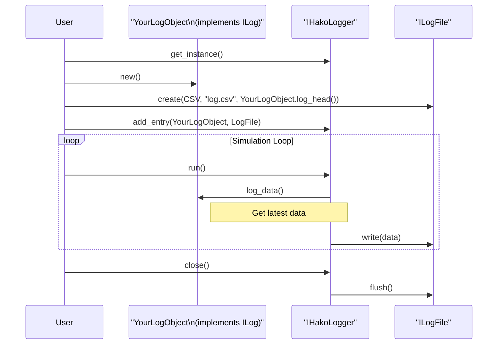

# Logger API ドキュメント

## 概要

### 名前空間: `hako::logger`

`logger` コンポーネントは、シミュレーション中の様々なデータをファイルに記録するための機能を提供します。構造化されたデータをCSVやJSON形式で出力する**構造化ロギング**と、開発中のデバッグに便利な**デバッグロギング**の2つの仕組みから構成されます。

---

### クラス設計

#### **構造化ロギング**

-   **`ILog`**: ログとして記録したいデータ構造を定義するためのインターフェースです。ロギング対象のクラスは、このインターフェースを実装し、ログのヘッダー情報（列名とデータ型）と、実際のデータを提供します。
-   **`ILogFile`**: ログデータを物理ファイルに書き出す処理を抽象化するインターフェースです。`create` メソッドにより、CSVやJSONなど、出力形式に応じたインスタンスを生成できます。
-   **`IHakoLogger`**: `ILog` (データ) と `ILogFile` (ファイル) を紐づけてロギング処理全体を管理するコアインターフェースです。複数のログエントリを管理し、定期的にファイルへの書き込みを実行します。

#### **デバッグロギング**

-   **`DebugLogger`**: 任意のタイミングで文字列メッセージをファイルに記録するためのシングルトンクラスです。初期化時に指定したファイルに、タイムスタンプ付きでデバッグメッセージを出力します。`IHakoLogger` のような複雑な設定なしに、手軽に利用できます。

---

## クラス図

## シーケンス図 (構造化ロギング)

`IHakoLogger` を使用した構造化ロギングの典型的なシーケンスを示します。

