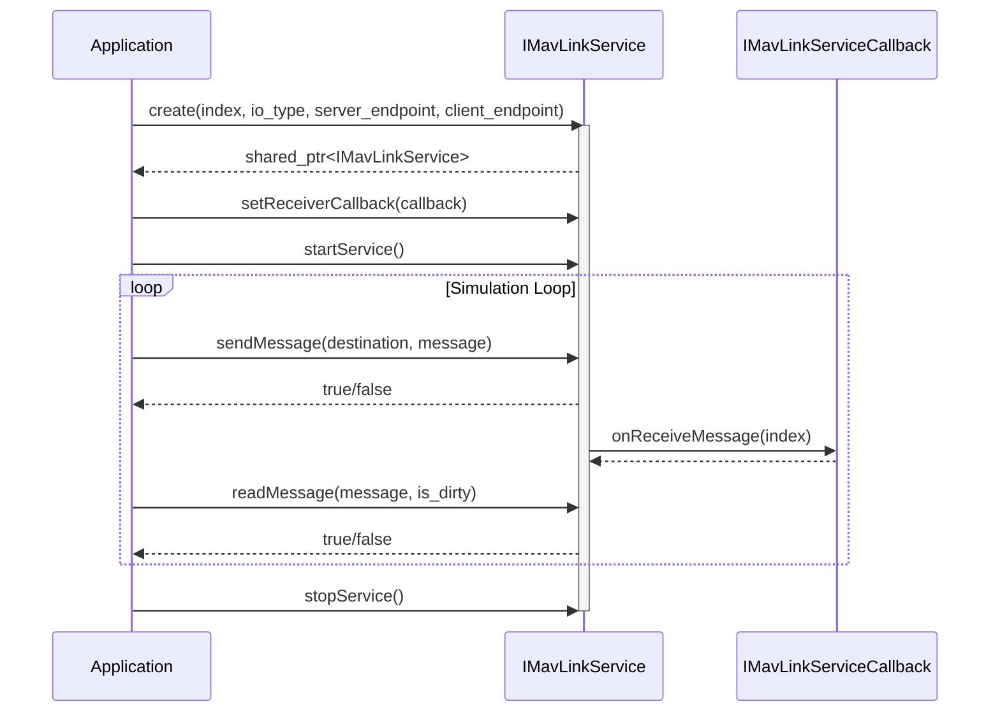

# MAVLINK API ドキュメント

## 1. 概要

`mavlink` コンポーネントは、MAVLinkプロトコルを用いた通信機能を提供します。ドローンシミュレーションにおいて、フライトコントローラー（PX4 SITLなど）やMAVProxyとのデータ送受信を抽象化し、シミュレーション環境と外部システム間の連携を可能にします。

名前空間: `hako::mavlink`

## 2. 主要なクラス、構造体、列挙型

-   **`IMavLinkService`**: MAVLink通信サービスを管理するための主要なインターフェースです。サービスの開始・停止、メッセージの送受信、コールバックの設定などを行います。
-   **`IMavLinkServiceCallback`**: MAVLinkメッセージ受信時に呼び出されるコールバックインターフェースです。
-   **`MavLinkServiceContainer`**: 複数の `IMavLinkService` インスタンスを管理するためのコンテナクラスです。
-   **`MavlinkServiceIoType`**: MAVLinkサービスのI/Oタイプ（TCPまたはUDP）を定義する列挙型です。
-   **`MavLinkServiceDesitinationType`**: MAVLinkメッセージの送信先タイプ（SITLまたはMAVPROXY）を定義する列挙型です。
-   **`MavlinkMsgType`**: サポートされるMAVLinkメッセージのタイプを定義する列挙型です。
-   **`MavlinkHakoMessage`**: 各種MAVLinkメッセージのデータを保持するための共用体を含む構造体です。`HakoHilSensor`, `HakoHilActuatorControls` などのPDUタイプが含まれます。
-   **`IMavlinkCommEndpointType`**: 通信エンドポイント（IPアドレスとポート番号）を定義する構造体です。
-   **`MavLinkUserCustomDecoderType`**: ユーザー定義のカスタムMAVLinkメッセージをデコードするための構造体です。

## 3. クラス図

```mermaid
classDiagram
    direction LR

    class IMavLinkService {
        <<interface>>
        +static create(int index, MavlinkServiceIoType io_type, const IMavlinkCommEndpointType* server_endpoint, const IMavlinkCommEndpointType* client_endpoint): shared_ptr<IMavLinkService>
        +addMavProxyClient(MavlinkServiceIoType io_type, const IMavlinkCommEndpointType& mavproxy_endpoint): bool
        +setReceiverCallback(IMavLinkServiceCallback& callback): bool
        +sendMessage(MavLinkServiceDesitinationType destination, MavlinkHakoMessage& message): bool
        +sendMessage(MavlinkHakoMessage& message): bool
        +readMessage(MavlinkHakoMessage& message, bool &is_dirty): bool
        +startService(): bool
        +stopService(): void
        +setUserCustomDecoder(MavLinkUserCustomDecoderType decoder): bool
    }

    class IMavLinkServiceCallback {
        <<interface>>
        +onReceiveMessage(int index): void
    }

    class MavLinkServiceContainer {
        +addService(shared_ptr<IMavLinkService> service): void
        +getServices(): vector<shared_ptr<IMavLinkService>>&
    }

    IMavLinkService --|> IMavLinkServiceCallback : uses
    MavLinkServiceContainer o-- IMavLinkService : contains

    enum MavlinkServiceIoType {
        TCP,
        UDP,
        NUM
    }

    enum MavLinkServiceDesitinationType {
        SITL,
        MAVPROXY
    }

    enum MavlinkMsgType {
        UNKNOWN,
        HEARTBEAT,
        ...
    }

    class MavlinkHakoMessage {
        +MavlinkMsgType type
        +union data
    }

    class IMavlinkCommEndpointType {
        +const char* ipaddr
        +int portno
    }

    class MavLinkUserCustomDecoderType {
        +MavlinkMsgType type
        +bool (*user_custom_decode)(int index, const void* data, int detalen, hako::mavlink::MavlinkHakoMessage& message)
    }

    MavlinkHakoMessage -- MavlinkMsgType
    IMavLinkService -- MavlinkServiceIoType
    IMavLinkService -- IMavlinkCommEndpointType
    IMavLinkService -- MavLinkServiceDesitinationType
    IMavLinkService -- MavlinkHakoMessage
    IMavLinkService -- MavLinkUserCustomDecoderType

```

## 4. シーケンス図



## 5. APIリファレンス

- [MAVLink API](/docs/architecture/mavlink/api_mavlink.md)
- [MAVLink Service API](/docs/architecture/mavlink/api_mavlink_service.md)
