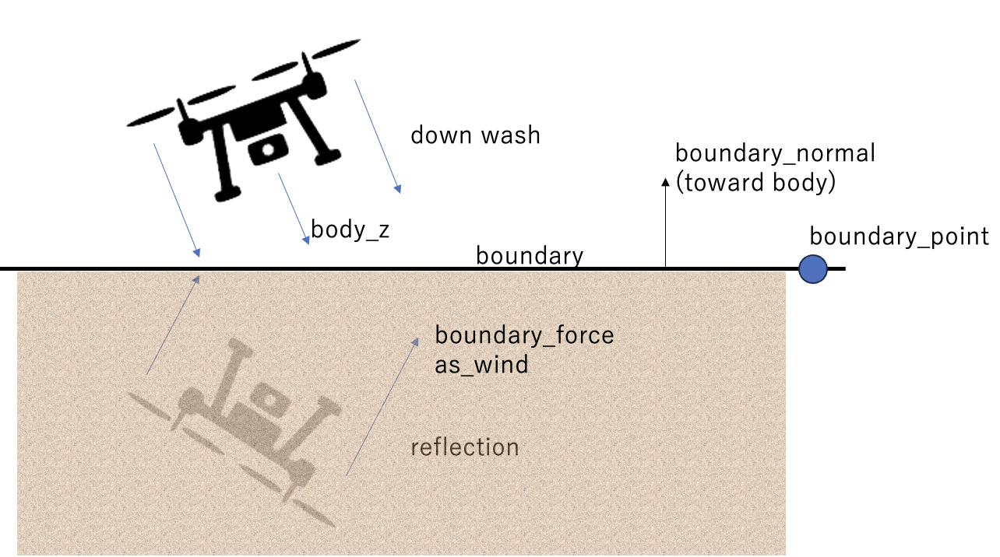
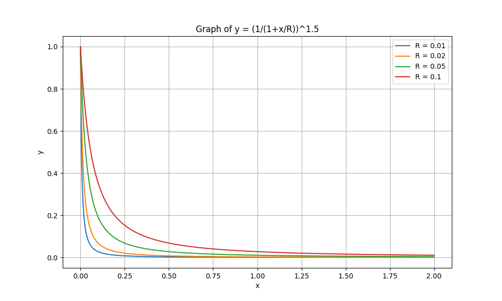

# Boundary Disturbance API

## Overview

This API calculates the effects of disturbance forces on a drone when it approaches boundaries such as:

- Ground
- Ceiling
- Walls

These three boundaries are modeled as planes and are handled by the same algorithm.
This disturbance is caused by the reflection of the rotor's downwash on the boundary surface, which can affect the drone's flight dynamics, especially during low-altitude operations like takeoff and landing.

When a drone hovers or flies near the ground, its lift and thrust increase due to the proximity of the ground. This effect increases the effective thrust generated by the rotors, allowing the drone to hover with less force than would be required in free space.

Similarly, when a drone approaches a ceiling, it experiences a similar effect, feeling as if it is being pulled towards the ceiling.

The force of these phenomena, known as "ground effect," is calculated assuming that the wind generated by the rotors is reflected off a nearby surface. This API provides functions to either calculate this force directly or to model it as an equivalent wind speed. All arguments use the ground coordinate system and are converted to the body coordinate system as needed (by `body_vector_from_ground`).

The area where this force is effective is only very close to the boundary.

## Functions
- `boundary_disturbance`: Calculates the disturbance force vector caused by proximity to a boundary.
- `boundary_disturbance_as_wind`: Converts the calculated disturbance force into an equivalent wind speed vector, which can be integrated into the physics model as a wind effect.

## Usage

Below is an example of how to use the `boundary_disturbance` function to calculate the force due to ground effect.

```cpp
// Define the state of the drone and the boundary
VectorType drone_position = {1.0, 2.0, 0.5}; // Drone's position in the ground coordinate system
EulerType drone_euler = {0.1, -0.1, 0.5};   // Drone's attitude
double current_thrust = 15.0;              // Current thrust
double rotor_radius = 0.1;                 // Drone's rotor radius

// Define the boundary (e.g., the ground)
VectorType boundary_point = {0.0, 0.0, 0.0};   // A point on the ground plane
VectorType boundary_normal = {0.0, 0.0, -1.0};  // The normal vector of the ground (pointing from the ground towards the drone)

// Calculate the disturbance force
ForceType disturbance_force = boundary_disturbance(
    drone_position,
    drone_euler,
    boundary_point,
    boundary_normal,
    current_thrust,
    rotor_radius
);

// This disturbance_force can be added to the total force acting on the drone in the physics simulation. Or,

// It can also be converted to an equivalent wind disturbance.
VectorType wind_dist_e = boundary_disturbance_as_wind(
    drone_position, drone_euler, boundary_point, boundary_normal, current_thrust, rotor_radius, {0.1, 0.1, 0.1}
);

// Convert the wind effect to the body coordinate system
VectorType w_d = body_vector_from_ground(wind_dist_e, drone_euler);

// Finally, apply the wind effect to the drone's acceleration
AccelerationType acceleration = acceleration_in_body_frame(..., (w + w_d), ...);
```

## Arguments

### `boundary_disturbance`
```cpp
ForceType boundary_disturbance(
    const VectorType& position,       /* Drone's position in the ground coordinate system */
    const EulerType& euler,           /* Drone's Euler angles */
    const VectorType& boundary_point, /* Point on the nearest boundary (in the ground coordinate system) */
    const VectorType& boundary_normal,/* Normal vector of the nearest boundary (pointing from the surface towards the drone) */
    double thrust,                    /* Drone's thrust (always >= 0) */
    double rotor_radius,              /* Influence of the rotor radius on the wind disturbance */
    double exponent = 1.5             /* Exponent for the disturbance ratio (typically 1.5) */
);
```

## Physical Model



The calculation is based on a model that simulates the reflection of the rotor's downwash from a nearby boundary. This results in an additional force acting on the drone. The model is implemented as follows:

1.  **Distance to Boundary Calculation**: The perpendicular distance ($d$) from the drone to the boundary plane is calculated. This effect is only active when the drone is sufficiently close to the boundary.

$$
    d = |(p_{drone} - p_{boundary}) \cdot n|
$$

Where $p_{drone}$ is the drone's position, $p_{boundary}$ is a point on the boundary, and $n$ is the normal vector of the boundary.

2.  **Thrust Vector Transformation**: The drone's thrust vector (along the body z-axis) is transformed into the ground coordinate system (e).

$$
    T_e = R(\phi, \theta, \psi)
    \left[ \begin{array}{c}
        0 \\
        0 \\
        T
    \end{array} \right]
$$

Where $R$ is the rotation matrix from the body coordinate system to the ground coordinate system, and $T$ is the magnitude of the thrust.

3.  **Reflected Force Calculation**: The thrust vector is reflected across the boundary plane to simulate the wind bouncing off the surface.

$$
    T_{ref} = T_e - 2 (T_e \cdot n) n
$$

This formula works for any type of boundary: ground, ceiling, or wall.

4.  **Disturbance Ratio Calculation**: The strength of the disturbance force decreases as the distance from the boundary increases. This is modeled by a scaling ratio ($ratio$) that depends on the distance $d$ and the rotor radius $R$.

$$
    ratio = \frac{1}{(1 + d/R)^{k}}
$$

Where $k$ is an exponent, typically set to `1.5` ($1 \le k \le 2$).

5.  **Final Disturbance Force**: The final disturbance force is the reflected force scaled by the calculated ratio.

$$
    T_{dist} = ratio \times T_{ref}
$$

## Wind Disturbance Version

The `boundary_disturbance_as_wind` function provides an alternative way to model the boundary effect. Instead of applying a direct force, it calculates an equivalent wind speed that would produce a similar drag effect on the drone.

This is achieved by dividing the calculated disturbance force by a drag coefficient (specifically, the z-component of the first-order drag coefficient `drag1.z` is used as a proxy for the approximation). $W$ is the wind speed [m/s]. $C_{drag}$ is the drag coefficient with respect to velocity.

$$
    W = T_{dist}/C_{drag}
$$

This allows the ground effect to be seamlessly integrated into a physics model that already accounts for wind disturbances.

This effect rapidly decreases with distance from the boundary and is only applied when the drone is sufficiently close to the boundary.



## References
- Algorithm Overview: https://github.com/hakoniwalab/hakoniwa-drone-pro/issues/54
- Ground Descent and Vortex Ring State: https://www.tead.co.jp/blog/%E3%83%9C%E3%83%AB%E3%83%86%E3%83%83%E3%82%AF%E3%82%B9%E3%83%BB%E3%83%AA%E3%83%B3%E3%82%B0%E3%83%BB%E3%82%B9%E3%83%86%E3%83%BC%E3%83%88%E3%81%A8%E3%81%AF%EF%BC%9F%E9%A3%9B%E8%A1%8C%E6%99%82%E3%81%AE/
- What to Know When Landing: https://www.fujitaka.com/fdps/column/column53.html