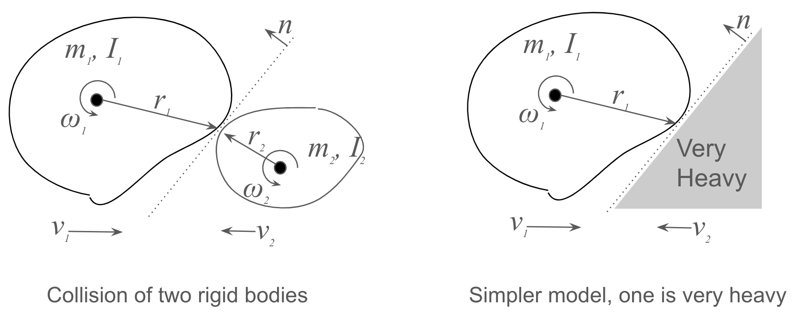

# Collision API

## Overview

This API calculates how velocity and angular velocity change due to collisions between drones, between a drone and a fixed wall, or contact between a drone and a hand in AR.

## Functions

`impulse_by_collision`

This function calculates the impulse caused by a collision. The coordinate system can be
any consistent system, but it's recommended to use the body_frame of your aircraft for all vectors. All vectors should be converted to this coordinate system. This function allows you to calculate the change in velocity and angular velocity. Impulse is the product of force and time. This quantity, $J$, can be gradually added to the velocity over several time steps, or the velocity can be updated at once as a pulse in a single update.

$$
\int_0^T Fdt = J \quad \text{($J$ is impulse - $T$ is contact time)}
$$

In practice, you will call the following functions to update velocity and angular velocity as needed:

- `delta_velocity_from_impulse`: Change in velocity before and after ($v' = v + \Delta_v$, add directly to velocity).
- `acceleration_from_impulse`: Acceleration ($\dot{v}$, integrate over time to get delta velocity).
- `acceleration_by_force`: Acceleration ($\dot{v}$, integrate over time to get velocity. Can be used for things other than collision).
- `force_from_impulse`: The force applied.
- `delta_angular_velocity_from_impulse`: Change in angular velocity before and after.
- `angular_acceleration_from_impulse`: Angular acceleration.
- `angular_acceleration_by_torque`: Angular acceleration (can be used for things other than collision).
- `torque_from_impulse`: The torque applied.

## Policy

Unlike the previous `velocity_after_contact_with_wall`, this API calculates the acceleration and angular acceleration due to the collision by finding the impulse (force and torque), rather than providing the post-collision velocity directly. This allows for integration with acceleration sensors and gyroscopes.

Also, if `contact_vector == normal_vector`, there is no change in angular velocity, and the result is the same as `velocity_after_contact_with_wall`.

## Usage

```cpp
ImpulseType impulse = impulse_by_collision(...);

// Handling velocity change
// Method 1: Change velocity at the current collision logic location
VelocityType delta_v = delta_velocity_from_impulse(...,impulse,...);
v_after = v_current + delta_v;

// Method 2: Add to acceleration and put it into the integrator
AccelerationType dv = acceleration_in_body_frame(...);
dv += acceleration_from_impulse(impulse,mass, delta_time); // Acceleration due to collision (accelerate at once)
v += delta_t * dv; // Update velocity (put into integrator)

// Handling angular velocity change
// Method 1: Change angular velocity at the current collision logic location
delta_w = delta_angular_velocity_from_impulse(impulse, r1, {Ix, Iy, Iz});
w_after = w_current + delta_w;

// Method 2: Add to acceleration and put it into the integrator
AngularAccelerationType dw = angular_acceleration_in_body_frame(...);
dw += angular_acceleration_from_impulse(...,impulse,...); // Angular acceleration due to collision
w += delta_t * dw; // Update angular velocity (put into integrator)
```

## Arguments
```cpp
ImpulseType impulse_by_collision(/* coordicates are ALL in one (self body) frame */
    const VelocityType& v1, /* self velocity in self body frame */
    const AngularVelocityType& w1, /* self angular velocity in self body frame */
    const EulerType& self_euler, /* {0,0,0} if you use self body frame(recommended) */
    const VelocityType& v2, /* other velocity in self body frame */
    const AngularVelocityType& w2, /* other angular velocity in self body frame */
    const EulerType& target_euler,
    const VectorType& r1, /* self contact vector, from self center to contact = contact_point - center_point in body frame */
    const VectorType& r2, /* vector from other center to contact = contact_point - other_center_point in body frame */
    double m1, /* self mass */
    double m2, /* other mass */
    const InertiaDiagType& I1, /* diagonal elements of the inertia tensor of the self */
    const InertiaDiagType& I2, /* diagonal elements of the inertia tensor of the other */
    const VectorType& normal, /* normal vector of the contact surface (n and -n give the same result, don't care the +/- direction) */
    double e /* restitution_coefficient 0.0-1.0*/) ;
```

#### NOTE
A version with fewer arguments will be created for cases where `other_mass`, `other_inertia` == Inf (when the other object is stationary). To reproduce the current behavior (`velocity_after_contact_with_wall`), use this version and set `normal_vector == contact_vector`.


## Mathematics

We will build a model that considers the dynamics during the contact time for a physics simulation of a collision. First, we define the basic variables. The diagram shows a general model of two rigid bodies and a simpler case where one has a much larger mass and moment of inertia (it is not affected by the collision). Here, we will proceed with the general case and also show the formula for the simpler model at the end.



- $m_1, m_2$: Mass of each rigid body
- $I_1, I_2$: Moment of inertia of each (about the collision point)
- $v_1, v_2$: Translational velocity vectors before collision
- $\omega_1, \omega_2$: Angular velocity vectors before collision
- $v'_1, v'_2$: Translational velocity vectors after collision
- $\omega'_1, \omega'_2$: Angular velocity vectors after collision
- $r_1, r_2$: Vector from the center of mass to the contact point
- $F$: Force vector at the contact point
- $n$: Normal vector of the contact surface
- $e$: Coefficient of restitution

Ignoring friction and considering the force only in the normal direction, from the force at the contact point (action-reaction), we have:

$$
F = f(t) n,   \quad \text{where $f(t)$ is a time-varying scalar function}
$$

We assume this and set up the following equations.

1.  Translational motion equation due to the force at the contact point:

$$
\begin{array}{rl}
m_1\dot{v_1} &= F \\
m_2\dot{v_2} &= -F \\
\end{array}
$$

2.  Rotational motion equation due to the force at the contact point:

$$
\begin{array}{ll}
I_1\dot{\omega_1} = r_1 \times F \\
I_2\dot{\omega_2} = r_2 \times (-F)
\end{array}
$$

(Note: These four equations are equivalent to the laws of conservation of momentum and angular momentum. Adding the top two equations eliminates $J$ to give conservation of momentum. Converting the bottom two equations to the moment of inertia at the contact point and adding them gives conservation of angular momentum.)

3.  Relative velocity at the contact point:

$$
v_{rel} = (v_1 + \omega_1 \times r_1) - (v_2 + \omega_2 \times r_2)
$$

4.  Considering the impulse from the collision:

$$
\int_0^T Fdt = J \quad \text{($J$ is impulse - $T$ is contact time)}
$$

5.  From the definition of the coefficient of restitution:

$$
v_{rel}' \cdot n = -e(v_{rel} \cdot n)
$$

Here, $v_{rel}$ is the relative velocity vector, $n$ is the normal vector of the contact surface, and the prime symbol ($'$) denotes the state after the collision.

By solving these equations simultaneously, we can determine the motion after the collision. As a specific solution method, assuming the collision is completely over after time $T$, we integrate (1) and (2) with respect to time. The left side becomes the difference in momentum and angular momentum (velocity and angular velocity) before and after, and the right side becomes the equation for $J$. Using this, we can formulate an equation for $J$ from the restitution equation (5), which can be solved for $J$. Finally, we use that to calculate the change in momentum and angular momentum after the collision from (1) and (2). Let's do it.

$$
\begin{array}{ll}
v_1' &= v_1 + J/m_1 \\
v_2' &= v_2 - J/m_2 \\
\omega_1' &= \omega_1 + I_1^{-1}(r_1 \times J) \\
\omega_2' &= \omega_2 - I_2^{-1}(r_2 \times J)
\end{array}
$$

Substituting these equations into equation (3):

$$
\begin{array}{ll}
v_{rel}' &= (v_1' + \omega_1' \times r_1) - (v_2' + \omega_2' \times r_2) \\
 &= (v_1 + J/m_1 + \omega_1 \times r_1 + I_1^{-1}(r_1 \times J) \times r_1) - (v_2 - J/m_2 + \omega_2 \times r_2 - I_2^{-1}(r_2 \times J) \times r_2) \\
 &= v_{rel} + (1/m_1 + 1/m_2)J + I_1^{-1}(r_1 \times J) \times r_1 + I_2^{-1}(r_2 \times J) \times r_2
\end{array}
$$

By substituting this into the restitution equation (5) and solving, we can find $J$.
Let $j_n = J \cdot n$, so $J = j_n n$ ($J$ is only in the normal direction, no friction), then:

$$
   j_n = -(1+e) (v_{rel} \cdot n)/ \left( \frac{1}{m_1} + \frac{1}{m_2} +
   (r_1 \times n) \cdot I_1^{-1} (r_1 \times n) + (r_2 \times n) \cdot I_2^{-1} (r_2 \times n) \right)
$$

Now we have found $J$. Based on this, we can calculate the changes in velocity and angular velocity.

If $m_2$ and $I_2$ are very large, this equation simplifies to:

$$
   j_n = -(1+e) (v_{rel} \cdot n)/ \left( \frac{1}{m_1} +
   (r_1 \times n) \cdot I_1^{-1} (r_1 \times n) \right)
$$

## How to Reflect in the Mover's Velocity and Angular Velocity
This calculation gives the impulse. From this, by adding the velocity change $J/m$ to the pre-collision velocity, the post-collision velocity is obtained. For angular velocity, add $I^{-1}(r \times J)$.

The above is a model in which velocity and acceleration change instantaneously. If you want to track the motion during the collision, you design $F(t), (0 \le t \le T)$. This function is also related to the spring constant of the rigid body surface. Then, you determine $F(t)$ and the contact time $T$ such that $\int^T_0 F(t) dt = J$, and during that time, you continue to apply the velocity and acceleration changes.

## Summary

We have formulated and found a solution for the change in velocity and angular velocity due to the collision of two rigid bodies.

This physical consideration was hinted at by Claude and Chat GPT o1 mini, and was reconciled with manual calculations.

-   Considerations by Chat GPT o1 mini
    https://chatgpt.com/share/6789c6a0-5d4c-8002-bc1e-e54169e4fdf4

## Helper Functions for Impulse

These are helper functions to calculate changes in velocity, acceleration, force, angular velocity, angular acceleration, and torque from a given impulse.

- `delta_velocity_from_impulse(impulse, mass)`: Calculates the change in velocity from an impulse.
- `acceleration_from_impulse(impulse, mass, delta_time)`: Calculates the acceleration from an impulse over a given time duration.
- `force_from_impulse(impulse, delta_time)`: Calculates the force from an impulse over a given time duration.
- `delta_angular_velocity_from_impulse(impulse, r1, I1)`: Calculates the change in angular velocity from an impulse, considering the contact vector and inertia tensor.
- `angular_acceleration_from_impulse(impulse, r1, I1, delta_time)`: Calculates the angular acceleration from an impulse over a given time duration.
- `torque_from_impulse(impulse, r1, delta_time)`: Calculates the torque from an impulse over a given time duration.