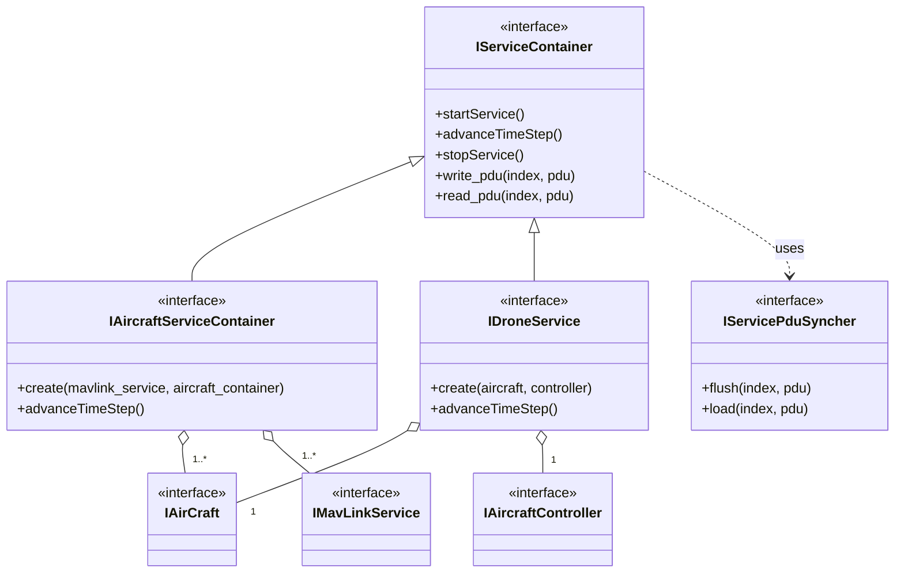
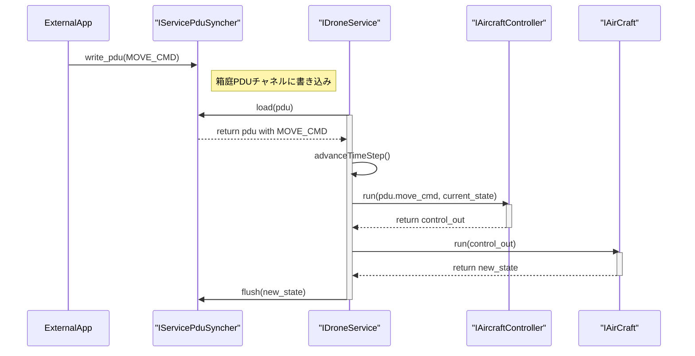

# Service API ドキュメント

## 概要

### 名前空間: `hako::service`

`service` コンポーネントは、`aircraft` や `controller` といった下位のコンポーネントを組み合わせて、具体的なユースケースに対応した「ドローンサービス」を提供するレイヤーです。シミュレーションの実行制御（開始、停止、時間進行）や、PDU (Protocol Data Unit) を介した外部との通信を担当します。

本コンポーネントは、主に2種類のサービスを提供します。

1.  **`DroneService`**: 内部の `controller` を使用して自律的に動作するドローンサービス。
2.  **`AircraftService`**: 外部のフライトコントローラー（例: PX4 SITL）とMAVLinkで連携するサービス。

---

### クラス設計

#### **`IDroneService`**

-   **役割:** `IAirCraft` (機体) と `IAircraftController` (制御) を1対1で内包し、自己完結したドローンとして振る舞うサービスです。
-   **通信:** PDU (`ServicePduDataType`) を介して、外部から「離陸」「移動」といった高レベルなコマンドを受け付けたり、ゲームコントローラーからの操作を受け取ったりします。

#### **`IAircraftServiceContainer`**

-   **役割:** `IAirCraft` (機体) と `IMavLinkService` (MAVLink通信) を連携させ、外部のフライトコントローラーと通信するためのサービスです。このサービスは内部に `IAircraftController` を持たず、制御ロジックは完全に外部に委ねられます。
-   **通信:** 主にMAVLinkプロトコルを用いて、HIL (Hardware-in-the-Loop) センサー情報などを外部に送信し、アクチュエーター制御情報を受信します。

#### **`IServiceContainer`**

-   **役割:** `IDroneService` や `IAircraftServiceContainer` のような、複数のサービスインスタンスを束ねて管理するためのコンテナインターフェースです。

#### **`IServicePduSyncher`**

-   **役割:** 箱庭のPDUチャネルと各サービスのPDUデータとの間で、データの同期（読み出し・書き込み）を行うためのインターフェースです。

---

## クラス図

## シーケンス図 (DroneService)

`IDroneService` が外部から制御コマンドPDUを受け取り、シミュレーションを1ステップ進める流れを示します。

