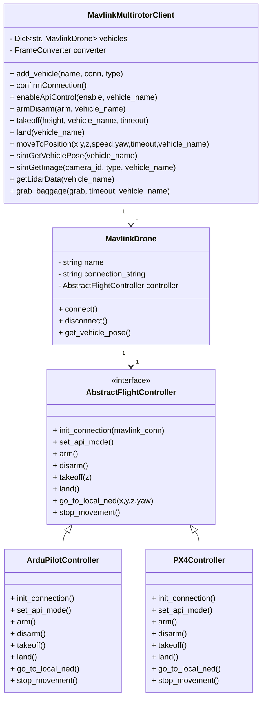

# Python API (for Ardupilot / PX4)

## Overview
This is a Python API for controlling the Hakoniwa drone simulator.
It supports both Ardupilot and PX4 via MAVLink, allowing you to control them with identical API calls.

## Features
- Basic control via API
  - ARM / DISARM
  - Takeoff / Land
  - Move to a specified position
- Retrieve sensor information
  - LiDAR data
  - Camera images
  - Drone pose
- Simultaneous control of multiple vehicles
  - Mix Ardupilot / PX4 using `add_vehicle()`
- Baggage operations (grab / release)

## How it works
- It uses `pymavlink` as the MAVLink communication library.
- Acquisition of sensor data (LiDAR/Camera), which is achieved in coordination with a game engine (Unity/Unreal), is implemented via the Hakoniwa PDU.
- Flight stack-specific differences are absorbed by `ArduPilotController` / `PX4Controller`.
- The high-level API is provided in an integrated manner by `MavlinkMultirotorClient`.

## Class Design Overview
### AbstractFlightController
- A common abstract class for flight controllers.
- Defines `set_api_mode`, `arm`, `takeoff`, `land`, and `go_to_local_ned`.

### ArduPilotController / PX4Controller
- Concrete implementations of `AbstractFlightController`.
- Ardupilot: Implements GUIDED/STABILIZE mode settings, waiting for GPS FIX, etc.
- PX4: Implements OFFBOARD mode and setpoint streaming in a thread.

### MavlinkDrone
- A class representing a single drone.
- Handles connection establishment, pose acquisition, disconnection, etc.

### MavlinkMultirotorClient
- A client that manages multiple vehicles in an integrated way.
- Users call the API through this class.
- Main methods:
  - `add_vehicle(name, conn, type)`
  - `enableApiControl`, `armDisarm`, `takeoff`, `land`, `moveToPosition`
  - `simGetVehiclePose`, `simGetImage`, `getLidarData`, `grab_baggage`

## Class Diagram

## Usage Examples
For actual execution procedures, please refer to the following:
- [Multi-vehicle simulation with Ardupilot](/docs/multi_drones/ardupilot.md)
- [Multi-vehicle simulation with PX4](/docs/multi_drones/px4.md)
