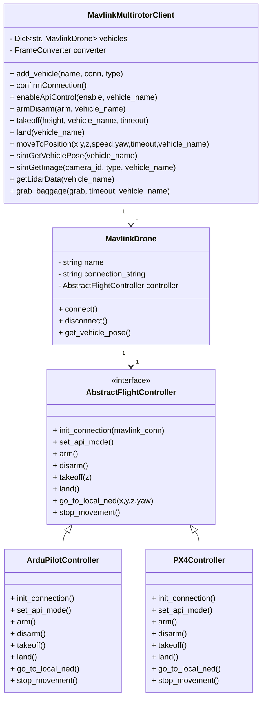

# Python API (Ardupilot / PX4 対応)

## 概要
箱庭ドローンシミュレータを Python から制御する API です。  
MAVLink 経由で Ardupilot / PX4 の両方に対応し、同一の API 呼び出しで制御できます。

## できること
- API 経由での基本制御  
  - ARM / DISARM  
  - 離陸 / 着陸  
  - 指定位置までの移動
- センサ情報の取得  
  - LiDAR データ  
  - カメラ画像  
  - ドローン姿勢（Pose）  
- 複数機体の同時制御  
  - `add_vehicle()` で Ardupilot / PX4 を混在可能  
- 荷物操作（grab / release）

## 仕組み
- MAVLink通信ライブラリは、`pymavlink` を利用
- ゲームエンジン(Unity/Unreal)連携して実現できるセンサデータ(LiDAR/Camera)の取得は、箱庭PDUを介して実装
- フライトスタック固有の差異は `ArduPilotController` / `PX4Controller` が吸収  
- 上位 API は `MavlinkMultirotorClient` が統合的に提供  

## クラス設計概要
### AbstractFlightController
- フライトコントローラ共通の抽象クラス  
- `set_api_mode`, `arm`, `takeoff`, `land`, `go_to_local_ned` を規定

### ArduPilotController / PX4Controller
- AbstractFlightController の具象実装  
- Ardupilot: GUIDED/STABILIZE モード設定や GPS FIX 待ちなどを実装  
- PX4: OFFBOARD モード、スレッドでの setpoint streaming を実装

### MavlinkDrone
- 単一ドローンを表すクラス  
- 接続確立、姿勢取得、切断などを担当

### MavlinkMultirotorClient
- 複数機体を統合管理するクライアント  
- 利用者はこのクラスを介して API を呼び出す  
- 主なメソッド:  
  - `add_vehicle(name, conn, type)`  
  - `enableApiControl`, `armDisarm`, `takeoff`, `land`, `moveToPosition`  
  - `simGetVehiclePose`, `simGetImage`, `getLidarData`, `grab_baggage`

## クラス図

## 使用例
実際の実行手順については以下を参照してください。
- [Ardupilotでの複数機体シミュレーション](/docs/multi_drones/ardupilot.md)
- [PX4での複数機体シミュレーション](/docs/multi_drones/px4.md)

